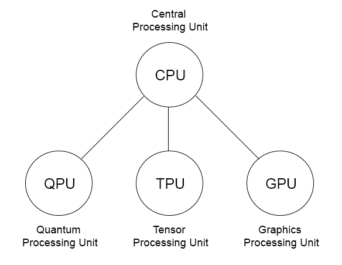
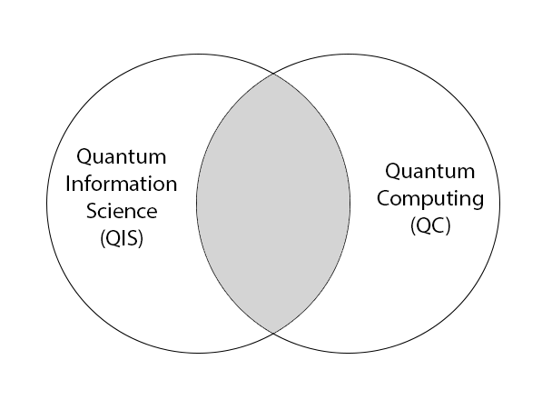
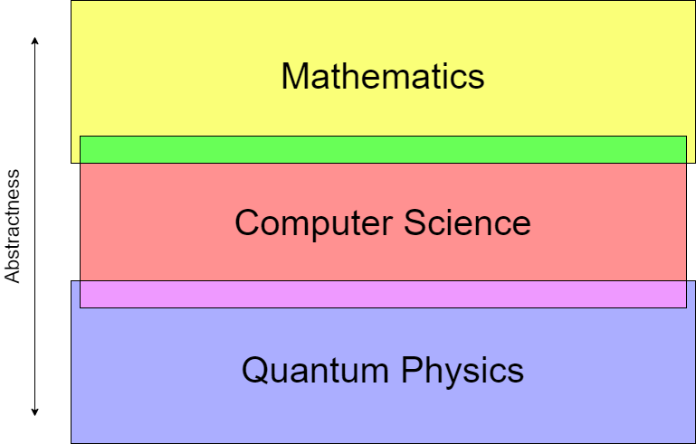

# [QCSG](..)

<h3>The Quantum Computing Survival Guide</h3>

##### Written by River Way

[toc]

## Chapter 1:   Why Quantum Computing?

The entire document is used to describe what quantum computing is, but I think it is important to understand why quantum computers are important. What is their history and what can they do for society? 

### [1.1](#QCSG)   The New Age of Computing

Gordon Moore made an observation that the number of transistors in an integrated circuit doubles every 2 years, known as _Moore's Law_. There are only two ways to increase the number of transistors: make them smaller, or make the chip larger. So far we have continued to choose the first option, finding new methods to make the transistors smaller and smaller each year to follow this pattern. However, scientists can't continue to make them smaller forever. After all, we are bounded by the physical limits of our universe. The size of transistors can't breach the atomic barrier, becoming smaller than atoms. It is unclear when our computers will begin to diverge from Moore's Law.

Luckily, the end of Moore's Law does not mean the end of improvement for computers. There are certainly other methods to give computers more memory, make them faster, and improve power consumption. Once such method is the use of specialized hardware. Rather than doing every single operation on the _Central Processing Unit (CPU)_, computers can delegate specific tasks to other hardware which are designed to be efficient at certain types of jobs. One common example is the _Graphics Processing Unit (GPU)_, which is a separate device used to handle massively parallel programs. The architecture and style of programming for GPUs is different than CPUs. There are some problems that run incredibly fast on a GPU, however some problems actually run slower. 

Every algorithm has a _time complexity_, a formula describing how long the algorithm takes to run based on the size of the input. If we built new hardware which could significantly lower the time complexity for certain problems, it would signal a new age for computers. Introducing _quantum computers_: computers which run off of different principals than classical computers, derived from the laws of quantum mechanics. 

<i>Do scientists just put the word 'quantum' in front of everything?</i>

To answer your question: pretty much. Formally, the word _quantum_, and its plural _quanta_, can be used to describe any discrete chunk of something. In science, especially physics and chemistry, quantum is used to describe the study of very small particles: atoms, electrons, quarks, photons, etc. A quantum computer is any machine which uses a series of transformations, based off of quantum physics, to manipulate data into a desired result. These quantum computers are significantly different than classical computers. The methods of storing, transforming, and reading quantum data is unintuitive from a classical computer's perspective.

Researchers have shown that some problems such as integer factoring and searching unsorted data can be implemented more efficiently on a quantum computer than a classical one. Using a _Quantum Processing Unit (QPU)_, a CPU could send it specific jobs which are solved much faster on a quantum computer. There are many issues plaguing current quantum computers which make them difficult to offer to the general public, but the future of quantum computing looks very bright and there is still much to be discovered. 

<i>Figure 1.1.1 A Possible Future Computer Architecture</i>

This figure shows a potential architecture of future computers. The central processing unit would act as the manager for the computer, running a majority of the operating system and delegating specific tasks to the devices suited for them. 

Another possible architecture of future computers follows the trend of _cloud computing_ in which users send tasks to a quantum computing cluster over the internet. The result of the computation would be sent back to the user when the program finishes. If our society begins to focus more on subscription services, this may end up becoming a more popular alternative to owning your own quantum computer.

### [1.2](#QCSG)   A Brief History of Quantum Computing

The birth of quantum computing can be attributed to a man named Richard Feynman. Famous for a plethora of accomplishments in physics during the twentieth century, one of his biggest was the discovery of quantum electrodynamics. He was interested in simulating many different particles to verify his theory, but found that classical computing did not have the ability to effectively produce the results he was looking for. So, in the early 1980s, he proposed the idea of a quantum computer. Unfortunately, there was not a high demand for this type of computation and constructing a quantum computer is immensely difficult. For the next few decades, the field of quantum computing progressed slowly. 

Then, in 1994, Peter Shor shocked the world with his quantum algorithm to factor integers in polynomial time. This not only revealed there was some use in quantum computing, but that there were probably many other useful quantum algorithms yet to be invented. Not too long after came Grover's algorithm along with other quantum search algorithms. By the late 1990s, the theoretical field of quantum computing was alive with activity.

#### The Field(s) of Quantum

The field of quantum computing has foundations in quantum physics, but ultimately, they have separated. New students looking to study quantum computing don't need previous knowledge from quantum physics similar to how classical computer scientists don't need knowledge from electrical engineering. 

<i>Figure 1.2.1 The Two Parallel Fields</i>

Quantum information science is a parallel field of study to quantum computing, and the material often overlaps. Both fields are very new, less than half a century old, and have yet to be thoroughly defined. It is difficult to say if these fields are separate from one another or if these are both subsections of the same field. Typically, quantum information science covers the theory behind combining quantum mechanics with Turing machines, pioneered by Paul Benioff in the early 1980s. Quantum computing covers the implementation of a quantum computer and how it interacts with a classical computer. Both fields cover qubits, quantum circuits, entanglement, and teleportation which are discussed in this document. At this moment, it is unclear if the overlap between the fields is so large that they will be joined or if they will diverge. Only the time will tell.

#### Learning Approaches to Quantum Computing

Typically, there are three approaches to learning about quantum computing. These depend on which field the student is coming from. With classical computers, the fields in order of increasing abstractness are: electrical engineering, computer engineering, computer science, and mathematics. Electrical engineers deal with the physical implementations of computers, mathematicians deal with the proofs of logic, and the computer engineers & scientists fill in the gaps.

<i>Figure 1.2.2 The Parent Fields</i>

Quantum computing also has a similar structure of parent fields. The physical implementations involving working with quantum particles are done by physicists, the proofs for computation are handled by mathematicians, and the computer scientists bridge that gap. This document will primarily be focused on the computer scientist's perspective, although we will be exploring a little bit into the other sides. In the future we expect numerous subfields to appear, dealing with various aspects of quantum computing.

#### Historic Quantum Computers

Many different types of quantum computers have been designed over the past few decades. A few of the important milestones for the development of physical implementations are listed here:

* 1995 - <a href="https://tf.nist.gov/general/pdf/140.pdf" target="_blank">First realization of a quantum logic gate</a>
* 1998 - <a href="https://pdfs.semanticscholar.org/6c05/5053f4f1605fdc0bd474c7a350dcd01f627d.pdf" target="_blank">First implementation of Grover's Algorithm on a 2 qubit computer</a>
* 2001 - <a href="http://cryptome.org/shor-nature.pdf" target="_blank">First implementation of Shor's Algorithm factoring 15</a>
* 2006 - <a href="https://web.archive.org/web/20070207105035/http://www.york.ac.uk/admin/presspr/pressreleases/kirkclone.htm" target="_blank">First demonstration of teleportation</a>
* 2011 - <a href="https://web.archive.org/web/20110515083848/http://physicsworld.com/cws/article/news/45960" target="_blank">First commercially available quantum annealer (D-Wave One)</a>
* 2016 - <a href="https://arxiv.org/abs/1605.05709" target="_blank">First quantum computer available on the cloud (IBM)</a>
* 2019 - <a href="https://ai.googleblog.com/2019/10/quantum-supremacy-using-programmable.html" target="_blank">First instance of a claim to quantum supremacy (Google)</a>

### [1.3](#QCSG)   Modern Applications of Quantum Computers

Current quantum computers are room-sized machines which require dozens of skilled technicians to operate. They are owned by research teams at universities or companies and generally not available to the public. There are exceptions, such as IBM's small quantum computer which can be used over the cloud, but there are severe limits to the compute capabilities of such quantum computers. 

For reasons discussed later, simulating quantum phenomena on classical computers is tricky. However, it stands to reason that simulating quantum phenomena on a quantum computer would be much easier. Modern quantum computers are not large enough to run many of the algorithms designed for them, but simulating other quantum particles requires relatively few resources. This makes quantum simulation a viable target for near-term applications. 

### [1.4](#QCSG)   Future Applications of Quantum Computers

Quantum computers hold enormous potential to solve some of the world's hardest problems in the future. Once the hardware for quantum computers has been developed and refined, our society will be able to tackle the problems which classical computers have struggled with. Here are a few examples of how quantum computers will be able to help other areas of science.

#### Cryptography and Network Security

When discussing the history of quantum computers, we have introduced Shor's algorithm. This quantum algorithm is able to factor integers efficiently which undermines the RSA protocol for key exchange. If a quantum computer was suddenly introduced today, it would overturn modern society because we are not yet prepared for switching from RSA to another protocol. Luckily, it seems quantum computers large enough to factor RSA numbers are more than a decade away. 

With the bad, there comes some good as well. Even though quantum computers threaten to shake our cryptography, they also enable us to create quantum networks which are able to transfer data securely, guaranteed by the laws of physics.

#### Artificial Intelligence

The intersection between artificial intelligence and quantum computing is a new area of research in the academic community and has a promising future. Quantum algorithms have been developed for solving optimization problems, of which artificial intelligence is just a subset. Finding optimal solutions using quantum computers also has benefits to many other disciplines such as finance for portfolio management, transportation for delivery routes, and manufacturing for factory layout.

#### Pharmaceutical Development

As discussed in the previous chapter, it seems natural for quantum computers to simulate quantum interactions much better than classical computers. One of the most exciting applications of this is drug development in the pharmaceutical industry. Medicine compounds are made up of many molecules and perfectly simulating their interactions on a classical computer is infeasible. One day, chemical experiments might be reduced to running a quantum program and finding how all the molecules interact with each other.

------

​         [$\leftarrow$Preface](../preface)                                                                                                                                                                                                              [Chapter 2$\to$](../chapter2)	