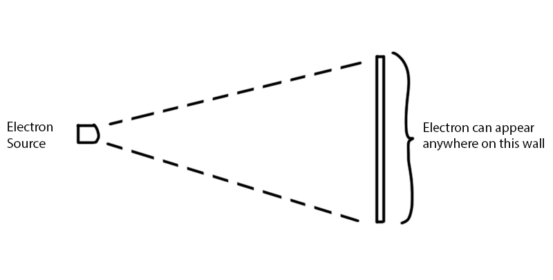
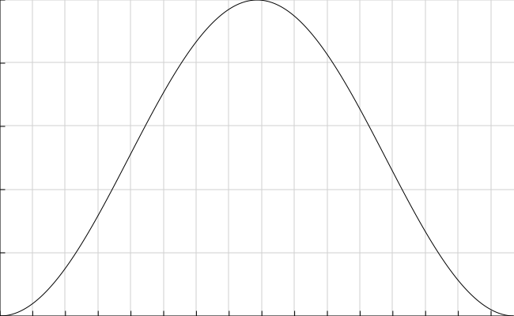
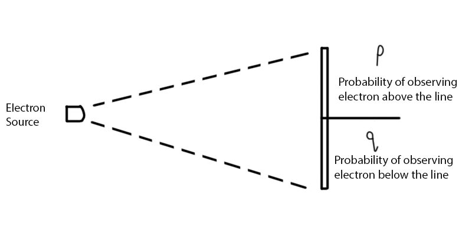
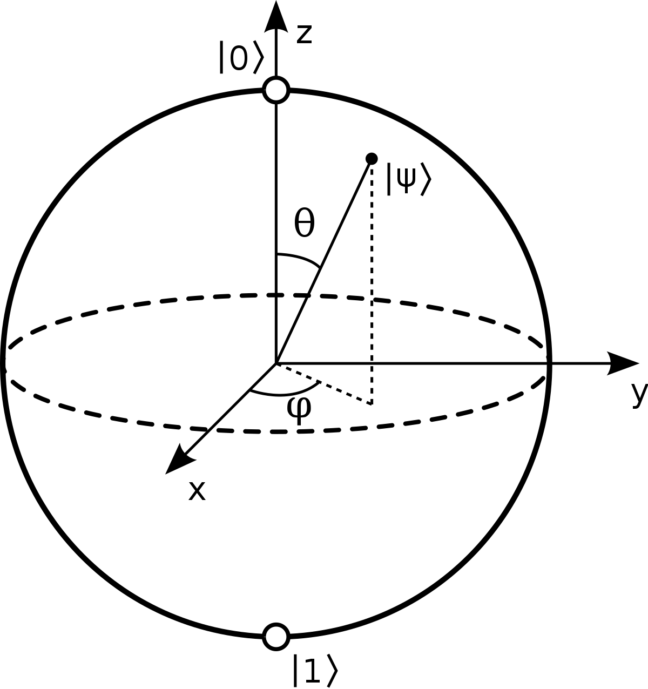

# [QCSG](..)

<h3>The Quantum Computing Survival Guide</h3>

##### Written by River Way

[toc]

## [Chapter 2:](#QCSG)   Qubits & Superposition

The smallest possible unit of data in a classical computer is a _bit_. It stands for binary digit. A single bit can either be zero or one. The term 'bit' is often used interchangeably with _boolean_, whose value is either true or false. Every piece of data which can be stored in a computer's memory is a sequence of these bits. Qubits are the smallest possible unit of data in a quantum computer and they have more properties than ordinary bits.

### [2.1](#QCSG)   Quantum Particles

Although this document is focused towards computer scientists, it is important to learn about the nature of quantum particles to understand where qubits come from. This explanation will only scrape the surface of the wonderful world of quantum physics, but it will suffice for the purposes of this document.

Quantum particles have close ties to _waves_, a mathematical function which can be described by four attributes: the amplitude, frequency, and horizonal & vertical shifts. A wave function has the following form:
$$
F(x)=A\sin(B(x+C))+D
$$

<iframe height='500' scrolling='no' title='Sine Wave Applet' src='..\resources\applets\sin_wave\index.html' frameborder='no' allowtransparency='true' allowfullscreen='true' style='width: 100%; user-select:none;'>Sine Wave Applet</iframe>

<i><a href="../resources/applets/sin_wave/index.html" target="_blank">Applet 2.1.1</a> The Sine Wave</i>

This figure shown above is called an _applet_. It is an interactable program embedded inside the document which allows readers to change values to view the topic in depth. For this applet, you can click and drag on the green sliders which change the 4 values to see their impact on the wave.

Several famous experiments, such as the double slit experiment, have shown that light and matter can have properties of both particles and waves. This is known as _wave/particle duality_. When an electron is released from a source, it acts as a wave which propagates through space until contacting a surface. Once the electron collides with a surface, it is only observable in one location. 

<i>Figure 2.1.2 - Electron Colliding with a Wall in a Random Location</i>

The location where it will be observable is random and cannot be determined ahead of time. However, the likelihood of the electron appearing in a specific location can be calculated using a probability function.  

<i>Figure 2.1.3 - A Probability Function</i>

The function shown above contains information on how likely the electron is to be observed at a specified location. In this graph, the X axis is the location and the Y axis is how likely it is to appear at that location. The electron is very likely to appear somewhere in the middle and it is very unlikely to appear near the edges. In the bottom left corner of this graph, when $x=0$ it shows that $y=0$ as well. This means the electron can __never__ appear at location 0. The same logic applies at the bottom right corner.

The rest of this document is dedicated towards explaining the rules governing qubits and their interactions, this is the only section which makes an attempt at showing where the rules are derived from. An inquiring mind may ask "why do qubits follow these rules specifically?" and the only answer is because they follow from the laws of quantum mechanics.

###  [2.2](#QCSG)   Modeling Waves with Vectors

The fundamental unit of information in classical computers are bits. They can either be on or off. There are only two possible states. Figure 2.1.2 shows a probability function which is continuous, there are an infinite number of locations, each with their own probability of being observed at said location. To make these probability functions palatable to computer scientists, the probability functions need to be transformed into binary.

There are already many decades worth of development in computer science which is in binary. Having two states allows quantum computer scientists to create algorithms, build architectures, and store data based on classical computers without factoring in a change of radix. Another reason for dividing the continuous function into two sections is because it makes many physical implementations of qubits easier.

To extend our example from the previous section, we can convert to binary by drawing a line across our wall and seeing if the electron is observed above or below the line. The electron has a probability $p$ of being above the line where $p$ is $0\leq p\leq1$. There is also a probability of $q = 1-p$ that the electron is below the line where $q$ is also $0\leq q\leq1$. 

<i>Figure 2.2.1 - Electron Colliding with a Discretely Sectioned Wall</i>

What we have just described is known as a _probabilistic bit_, or _pbit_. A pbit is a bit which has a certain probability or being off, which we have denoted above as $p$. It also has a certain probability of being on, which we have denoted above as $q$. As both these values are probabilities, they are constrained to $p+q=1$. The concept of a pbit is not exclusive to quantum, they also are used in binary classifiers from machine learning, random number generators, etc.

Our goal is to convert a wave equation like the sine function into a pbit. One of the first things a precalculus course teaches is the relationship between trigonometric functions and circles. Taking a look at the unit circle, we can see the X and Y coordinates of the circle with radius 1 are the outputs of the cosine and sine functions.

<iframe height='500' scrolling='no' title='Unit Circle Applet' src='..\resources\applets\unit_circle\index.html' frameborder='no' allowtransparency='true' allowfullscreen='true' style='width: 100%; user-select:none;'>Unit Circle Applet</iframe>

<i><a href="../resources/applets/unit_circle/index.html" target="_blank">Applet 2.2.2</a> The Unit Circle</i>

A _vector_ is a mathematical object which has both magnitude and direction. We have a vector here whose magnitude is $1$ and direction is determined by the variable $\theta$, the angle from the positive X axis to the vector. $\theta$ is called a _polar coordinate_ which is the input to the trigonometric functions that produce the cartesian coordinates $x$ and $y$. The vector $\mathbf{v}$ is described as:
$$
\mathbf{v}=\begin{bmatrix}x\\y\end{bmatrix}=\begin{bmatrix}\cos\theta \\ \sin\theta\end{bmatrix}
$$
This can be used to fit our description of a pbit by remembering the Pythagorean trigonometric identity:
$$
\begin{aligned}
x^2+y^2&=1 \\
\cos^2\theta+\sin^2\theta &= 1 \\
p + q &= 1
\end{aligned}
$$
From this we can see our probabilistic bit relate to the quantum wave functions as:
$$
p = \cos^2\theta \\
q = \sin^2\theta
$$
Since $p$ and $q$ are always positive, we can apply the constraint $0\leq\theta\leq\frac{\pi}{2}$. 

There are two unit vectors which are special enough to be named: $\hat{i}$ and $\hat{j}$. These vectors are both of length $1$ and are orthogonal to each other.
$$
\hat{i} = \begin{bmatrix}1\\0\end{bmatrix} \\
\hat{j} = \begin{bmatrix}0\\1\end{bmatrix}
$$
These _basis vectors_ represent our X and Y axes since $\hat{i}$ is directly along the X axis and $\hat{j}$ is directly along the Y axis. The vector $\mathbf{v}$ can be rewritten using vector addition:
$$
\mathbf{v} = \begin{bmatrix}\sqrt p \\ \sqrt q\end{bmatrix}
= \sqrt p\begin{bmatrix}1\\0\end{bmatrix}+\sqrt q\begin{bmatrix}0\\1\end{bmatrix}
= \sqrt p\hat{i}+\sqrt q\hat{j}
$$
After viewing this relationship, we see:

* $\hat{i}$ conceptually represents the off state, or 0, or the electron being observed above the line on the wall
* $\hat{j}$ conceptually represents the on state, or 1, or the electron being observed below the line on the wall
* $p$ and $q$ still represent the probabilities of those states occurring
* $\mathbf{v}$ represents the entire state of the pbit, or the electron & wall system 

This model of a pbit is not a completely new innovation, it is simply a transformation from the quantum wave equation which is easier to digest for computer scientists. 

However, our transformation is not complete. We have translated the probabilistic nature of quantum particles but there is still another feature of those particles which we have not translated: phase. Without including phase, we cannot say our model acts as a true quantum bit, also known as qubit.

Before extending our vector based model to the true qubit model, a new style of notation needs to be introduced. The notation of quantum physicists: the Dirac notation.

### [2.3](#QCSG)   Dirac Notation

Paul Dirac invented a notation system for discussing quantum mechanics and it has been adopted into quantum computing. The notation is called "bra-ket" since it uses the angle brackets $\langle\rangle$. Truly the peak of twentieth century physics humor. 

#### Ket Notation

Any vector can be expressed by placing it inside a vertical line  |  and right angle bracket  $\rangle$ . By placing it inside, $|\mathbf{v}\rangle$, we pronounce it "ket-v". This object conceptually represents a quantum state, however it is still mathematically equivalent to a vector. Specifically, a quantum state is a member of a _complex Hilbert space_, but thinking of them as vectors is acceptable in quantum computing. 

Since a ket represents a quantum state, we can put our own quantum states inside the ket like:|above-line$\rangle$ and |below-line$\rangle$ to represent the electron being observed above or below the line on the wall. Some more examples of kets are:

* |spin-up$\rangle$ and |spin-down$\rangle$ to represent the spin of a photon
* |ground$\rangle$ and |excited$\rangle$ to represent the energy level of an electron
* |/$\rangle$ and |\\$\rangle$ to represent diagonal and anti-diagonal polarization of light
* |clockwise$\rangle$ and |counterclockwise$\rangle$ to represent direction of current flow in a circuit

However by far the most common kets used in this document and in the quantum computing community are $|0 \rangle$ and $|1\rangle$. We can abstract away the physics used for the quantum state and focus on the value. Similar to how computer scientists don't care if their bit is representing a magnetic field in their hard drive or amplitude of current in a wire, they just care about the value. $|0\rangle$ and $|1\rangle$ can be any two orthogonal basis states in quantum mechanics. 

The quantum state representing an entire system is denoted by the special Greek letter $\psi$, written "Psi", and pronounced "Sai". Using all of this information, we can rewrite our pbit model using Dirac notation:
$$
\begin{aligned}
\text{Vector Notation}&\quad\mathbf{v} = \sqrt p\hat{i} + \sqrt q\hat{j} \\
\text{Dirac Notation}&\quad|\psi\rangle = \alpha|0\rangle + \beta|1\rangle
\end{aligned}
$$
Even though we have not extended the pbit to the full qubit model, the above equation still holds for qubits. This equation is called **The General Form of the Qubit** and is one of the most important concepts in all of quantum computing. 

It is important to understand that all of the symbols in the Dirac notation are the same mathematical objects. $|0\rangle$ and $|1\rangle$ are the exact same unit vectors previously represented by $\hat{i}$ and $\hat{j}$. $\alpha$ and $\beta$ are still scalars which determine the probabilities when squared.

Using our new form of notation, let's reason about the process of projecting an electron at a wall.  If the electron is detected above the line, then we know $|\psi\rangle=|0\rangle$. This is the same as saying "the state of the electron is the state of being above the line". On the other hand, if the electron is detected below the line, we know $|\psi\rangle=|1\rangle$. This is the same as saying "the state of the electron is the state of being below the line". 

However, what do we call the state before the electron contacts the wall? The electron is still a wave moving through space. We do not know if the electron will be observed above or below the line since it is random, but we know the likelihood of those events occurring: $|\psi\rangle=\alpha|0\rangle+\beta|1\rangle$. Until the electron makes contact with the wall, it is reasonable to say "the state of the electron is both the state of being above and below the line". In other words, the electron's state is a combination of the two outcome states. When a quantum state can only be described as a combination of two or more basis states, we say the quantum state is in _superposition_. 

#### Superposition

Superposition is one of those words which people think is more magical than it really is. Flipping a coin can be described with superposition too. When the coin is in the air, before it lands, the state can be modeled as: $|coin\rangle = {}^1{\mskip -5mu/\mskip -3mu}_\sqrt2|heads\rangle + {}^1{\mskip -5mu/\mskip -3mu}_\sqrt2|tails\rangle$. When this coin is twirling around in the air, you have no idea which side it will land on. At this moment in time, it is reasonable to say the coin is a combination of heads and tails. The coin is in superposition. To a human, the outcome of a coin flip is a random event. The only difference between the coin and the electron is if you have a good enough computer, it could simulate the physics of the coin toss and determine the outcome before the coin landed whereas the outcome of the electron cannot be determined before it lands. 

When the electron collides with the wall, it is observed. The moment the electron is observed, the state goes from being in superposition to a basis state. This process is called _collapsing_ and is instantaneous. The probabilities $\alpha^2$ and $\beta^2$ and destroyed and only the state $|0\rangle$ or $|1\rangle$ is left. Colliding with a wall is not the only way to collapse a quantum state. Making any sort of measurement or observation on the system will cause the superposition to be destroyed and the system will choose one of the basis states to collapse to using the assigned probabilities. 

Erwin Schrödinger is a famous physicist who was instrumental in developing the quantum wave equation. He also created a hypothetical scenario to help explain the concept of superposition: _Schrödinger's Cat_. This thought experiment describes putting a cat inside a soundproof box with a bomb which has a 50% chance to explode after 1 minute passes. After a minute passes, there are two possible outcomes of the experiment:

* The bomb explodes, and the cat is dead
* The bomb does not explode, and the cat is alive

However, to see if the cat is alive or not, the box must be opened. Let's begin the experiment. Put the cat inside the box, close it, and wait a minute. After the minute passes, what is the state of the cat? Is it alive or dead? We don't know. Nobody does, until the box is opened and the state is observed. Before the box is opened, we can say the state of the cat is in superposition. The cat is a combination of dead and alive at the same time. We can also model the state of the cat as: $|cat\rangle = {}^1{\mskip -5mu/\mskip -3mu}_\sqrt2|alive\rangle+{}^1{\mskip -5mu/\mskip -3mu}_\sqrt2|dead\rangle$. 

It is important to note that no cats were harmed in this theoretical scenario.

#### Bra Notation

The ket notation is used to describe column vectors; there is also a partner notation to describe row vectors: bra. The vector placed between a left angle bracket $\langle$  and a vertical line | is pronounced "bra-v": $\langle\bold{v}|$ . The bra is just the _conjugate transpose_ of ket, also called the _Hermitian transpose_.
$$
\langle\bold{v}| = |\bold{v}\rangle^\dagger
$$
Now that we have defined our mathematical notation for vectors, we can describe common operations seen in linear algebra.

The notation for matrix-vector multiplication is identical to the standard notation:
$$
BA|\bold{v}\rangle \\
|BA\bold{v}\rangle
$$
Matrices can be inside or outside of the ket, but the order is right-to-left. $A$ is applied first followed by $B$. 

Dot products, also called _inner products_, between two vectors can be described by a combined bra-ket notation:
$$
\langle\bold{u}|\bold{v}\rangle=\bold{u}^\top\bold{v}=\bold{u}\cdot\bold{v}
$$
In Dirac notation, this is called the "overlap" between $\bold{u}$ and $\bold{v}$ since the dot product is related to how far one vector can project onto another. A vector will always overlap completely with itself, so $\langle\psi|\psi\rangle=1$. Any two vectors which are mutually orthogonal will have no overlap, so $\langle0|1\rangle = 0$.

_Outer products_, which are not commonly used in this document, can still be described in Dirac notation:
$$
|\bold{u}\rangle\langle\bold{v}|=\bold{uv}^\top
$$
This product will produce an $m\times n$ matrix when $\bold{u}$ is an $m\times1$ vector and $\bold{v}$ is an $n\times1$ vector.

### [2.4](#QCSG)   Bloch Sphere Model

Now that we have a proper system of notation to discuss quantum states, we will extend our model of a pbit to the full model of a quantum bit, also called a _qubit_. Quantum particles have the ability to randomly collapse to a basis state, but they also have another key attribute called _phase_. 

Phase is another variable we need to account for in the model for the qubit, which means we will change the system of coordinates we have been using up until now.

#### Spherical Coordinates

_Polar coordinates_ is a system of coordinates in 2 dimensions which uses a distance from the origin and an angle to describe every possible point: $(r, \theta)$. Our pbit model used polar coordinates but restricted $r$ to always be equal to $1$. To introduce phase, we need to add another variable to our model and add another dimension. 

_Spherical coordinates_ is a system of coordinates in 3 dimensions which uses a distance from the origin, an angle from the positive Z axis, and an angle from the positive X axis to describe every possible point: $(r,\theta,\phi)$. In this model, $\theta$ is the angle from the positive Z axis and is called the _inclination angle_. $\phi$ is the angle from the positive X axis and is called the _azimuth angle_. 

This notation may differ from a multivariable calculus class, where $\theta$ & $\phi$'s roles are switched and $r$ is denoted $\rho$. We will be using the notation commonly used in physics and defined by the <a href="https://www.iso.org/standard/64973.html" target="_blank">ISO standard</a>.

<iframe height='500' scrolling='no' title='Bloch Sphere Applet' src='..\resources\applets\bloch_sphere\index.html' frameborder='no' allowtransparency='true' allowfullscreen='true' style='width: 100%; user-select:none;'>Bloch Sphere Applet</iframe>

<i><a href="../resources/applets/bloch_sphere/index.html" target="_blank">Applet 2.4.1</a> The Bloch Sphere</i>

This above applet allows the changing the values of $\theta$ and $\phi$ & moving the 3D sphere around by clicking and dragging. 

The **Bloch sphere**, named after Felix Bloch, is the full model of the qubit. It uses spherical coordinates to describe every possible state a quantum particle can occupy. A _pure state_ is any quantum state which lies on the surface of the unit sphere with radius $1$. A quantum state could also be a _mixed state_ which has radius less than $1$, but will not be discussed here. Here are some facts about our new Bloch sphere model:

* The aquamarine point indicates the current quantum state, $|\psi\rangle$.
* The $|0\rangle$ and $|1\rangle$ states are vertical and orthogonal to each other.
* The inclination angle, $\theta$, has the bounds: $0\leq\theta\leq\pi$
* The azimuth angle, $\phi$, has the bounds: $0\leq\phi<2\pi$

The fact that $|0\rangle$ and $|1\rangle$ are orthogonal to each other may be surprising and perhaps confusing. They certainly do not seem to be perpendicular, in fact they look parallel! Let us look at a static image of the Bloch sphere:

<i>Figure 2.4.2 - A Static Bloch Sphere</i>

A quantum state with radius 1 on the positive Z axis is $|0\rangle$ and one on the negative Z axis is $|1\rangle$. The reason why our orthogonal basis states are allowed to exist on the same axis is because the Bloch sphere technically exists inside _Hilbert space_ instead of the typical _Euclidean space_ we are used to. Don't sweat the details too much since Hilbert space is just a generalization of Euclidean space.

The basis coefficients $\alpha$ and $\beta$ can now be defined in terms of the inclination and azimuth angles:
$$
|\psi\rangle=\alpha|0\rangle+\beta|1\rangle=\cos(\frac{\theta}{2})|0\rangle+e^{i\phi}\sin(\frac{\theta}{2})|1\rangle
$$
When describing qubits, $\alpha$ and $\beta$ are complex numbers. Since they are complex, we need to make a minor adjustment to the formula describing the probability of collapse:
$$
P(|\psi\rangle=|0\rangle) = |\alpha|^2 \\
P(|\psi\rangle=|1\rangle) = |\beta|^2 \\
|\beta|^2 = 1 - |\alpha|^2
$$
The absolute value is necessary since we are now dealing with complex numbers. Not using it would mean some values of $\alpha$ and $\beta$ would yield negative probabilities, which are not allowed.

The basis coefficients can also be described in Dirac notation with overlap:
$$
\alpha=\langle0|\psi\rangle \\
\beta = \langle1|\psi\rangle
$$

#### Let's Talk Phase

Any description of phase would be incomplete without talking about _global phase_. Technically, the phase we have been working with in this section is formally defined as _relative phase_. When defining the basis coefficients $\alpha$ and $\beta$, we specifically stated that they are both complex numbers. However, looking at their definitions, $\alpha$ appears completely real. This is because the actual definition of the basis coefficients is:
$$
|\psi\rangle=e^{ia}(e^{ib}\cos(\frac{\theta}{2})|0\rangle+e^{ic}\sin(\frac{\theta}{2})|1\rangle)
$$
In this definition, $a$ is the global phase. The interesting fact about global phase is that physicists have concluded global phase does not have any impact on the qubit. Not even indirectly. We can arbitrarily set $a=-b$ so the complex part of $\alpha$ cancels out and leaves us with just a real part. Continuing this example, $\phi=c-b$  which is the relative phase. In this document, phase is always talking about relative phase. Global phase will always be explicitly labelled. 

Phase can be somewhat unintuitive at first glance. Why would we introduce (relative) phase to our model which does not directly affect the probability? The variable which represents phase, $\phi$, only appears in the $e^{i\phi}$ term in $\beta$. Furthermore, when determining the probability, $|e^{i\phi}|^2$ will always equal $1$ for any value of $\phi$. It seems that $\theta$ is the only variable which can influence the probability of collapse. However, phase can indirectly influence the probability of a qubit through the transformations described in the next section.

### [2.5](#QCSG)   Transforming a Qubit

Using qubits as data is only useful if we can edit their state. We used the Bloch sphere to geometrically describe the state of a single qubit, however we can't edit the angles $\theta$ and $\phi$ directly. The way we transform a quantum state is to rotate around the X, Y, or Z axis. 

There are many different systems of notation used for describing rotations around the Bloch sphere. The one we will use is exponentiation: $X^\Delta$.  This says rotate counterclockwise around the X axis by $\pi\Delta$ radians. The $\Delta$ describes how many half-revolutions to rotate. If $\Delta$ is negative then rotate clockwise instead. Replace X with Y or Z to rotate around another axis.
$$
X^0=0=0^\circ \\
X^{0.25}=\frac{\pi}{4}=45^\circ \\
X^{0.5} = \frac{\pi}{2}=90^\circ \\
X^{1} = \pi=180^\circ \\
X^{2} = 2\pi=360^\circ 
$$
Just like any angle, $\Delta$ is a cyclic number. For any number $n$ there exists a $0\leq\Delta<2$ which performs the same rotation.
$$
\Delta=n\ mod\ 2
$$
It is also common to replace $X^{0.5}$ with $\sqrt{X}$. Do not change $X^{-0.7}$ into $\frac{1}{X^{0.7}}$.

<iframe height='500' scrolling='no' title='Bloch Rotation Applet' src='..\resources\applets\bloch_rotations\index.html' frameborder='no' allowtransparency='true' allowfullscreen='true' style='width: 100%; user-select:none;'>Bloch Rotation Applet</iframe>

<i><a href="../resources/applets/bloch_rotations/index.html" target="_blank">Applet 2.5.1</a> Rotations on the Bloch Sphere</i>

The above applet shows how rotations impact the current state of the qubit on the Bloch sphere. The sliders on the left directly change $\theta$ and $\phi$ and the slider on the right changes $\Delta$. The buttons at the bottom change which axis the rotation is being applied to. Since $\Delta$ controls how far to rotate around the selected axis, it also changes $\theta$ and $\phi$. 

There is also a blue ring around the sphere which moves as the qubit state changes. It shows every location the qubit could be at after a rotation around the selected axis. This ring is the intersection of the surface of the Bloch sphere with a plane which is parallel to the other two axes. For example, when rotating around the X axis, the blue slice is parallel to the YZ plane and the X coordinate of the ring is the same as the qubit state. 

Looking at the blue ring introduces us to the concept of _state space_. Formally, state space is a set of states a qubit is allowed to occupy. We are currently talking about pure states, so the _pure state space_ of a qubit is the surface of the Bloch sphere. The _accessible state space_ of a rotation is the blue ring and it changes as the state being rotated changes. The accessible state space of a rotation is a proper subset of the pure state space. 

#### Collapse as a Transformation

Rotations are just one way of transforming a qubit's state. We previously talked about the process of measuring the qubit which collapses the superposition of the quantum state into a basis state. This operation is a transformation on the qubit because it manipulates the state. 

When thinking about the theory of quantum computation it can be helpful to separate the process of collapsing the quantum state into two halves: the _phase collapse_ and the _probability collapse_. The phase collapse, as the name implies, destroys the phase of the qubit and turns it into a probability. The probability collapse destroys the probability and turns it into a basis state. 
$$
\begin{equation}\begin{aligned}

& \text{phase_collapse}(|\psi\rangle): \\
&\qquad \text{return }|\alpha|^2 \\
\\
& \text{probability_collapse}(p): \\
&\qquad \text{if }(\text{random}()>p): \\
&\qquad\qquad \text{return }|1\rangle \\
&\qquad \text{else}: \\
&\qquad\qquad \text{return }|0\rangle

\end{aligned}\end{equation}
$$
When working with qubits in the real world, the two processes of collapse happen sequentially and instantaneously. There is no way to stop the collapse halfway through and observe the internal workings. One reason why it can be helpful to think about the phase and probability collapsing as separate processes is the task of state reconstruction. Consider a black box which can produce an unknown quantum state; once we observe the state, it collapses. Find the quantum state.

We are given an infinite number of identical quantum states, but they are hidden to us, so we need to glean information about what the unknown state is. Finding the probability of the qubit is easy, just measure $n$ of them and count how many times it collapsed to $|0\rangle$:
$$
P(|\psi\rangle=|0\rangle)\approx\frac{\text{count}(|0\rangle)}{n}
$$
However finding the phase of this unknown state takes more effort. Every value of $\phi$ maps to the same probability during the phase collapse, so just looking at the probability we acquired does not directly find phase. The good news is that the probability does narrow down the number of states it could be considerably.

When we didn't know anything about the black box's quantum state, the state space of what it could have been was the entire Bloch sphere. Now that we know what the probability is, it narrows down the state space to a ring around the Z axis. Sound familiar? The set of possible states our box produces is the very same set of states produced by the accessible state space of a Z rotation. As we know from the above applet, the accessible state space changes when we move the quantum state.

The key to finding the phase for our unknown state is to apply our own rotations and find the new probability after the rotation has been applied. When we apply a $X^{0.5}$ rotation, we are rotating the entire ring of possible states around the X axis. Now, the possible state space after the rotation is a ring around the Y axis. Once we observe the new probability, we can narrow down the set of possible states to just two. This is because every value of $\phi$ will produce a different probability after a rotation around the X axis. The only phase which maps to the same probability after a rotation is the opposite side of the ring. Since there are only two possible states that our black box can produce, we can apply a $Y^{0.5}$ rotation to our unknown state. This will produce different probabilities for the two different possible points which narrows it down to our unknown state.

We have successfully found our unknown state using $3n$ qubits produced from our black box! The variable $n$ controls how good the approximation is compared to the real state since $\lim_{n\to \infin}$ would be required to get a perfect representation. This process grows more complicated when there is more qubits involved, but it gives a nice introduction to the concepts of state space and phase versus probability collapse. 

When does this idea of a black box producing an infinite number of qubits occur in reality? Exceedingly often! When we run quantum programs on a quantum computer, we are asking the computer to perform a sequence of operations and then it produces a quantum state. We don't know what this state is; if we did, why would we need to run the quantum program? However, simply running the program once and then measuring the outcome isn't useful because of the randomness involved with collapsing superposition. To see the result of our computation, we need to run the program many times and use a similar method to the one outlined above to find the quantum state. Using the above method requires running the program $3n$ times.

Thinking about the process of measurement and collapse in theoretical terms is straightforward, but the actual physics concerning collapse is not well understood and is called the _measurement problem_. Since we are unable to directly observe the collapse process, it is difficult to study. Perhaps one day physicists will have a better understanding of how and why superposition collapses which will allow us to avoid using approximations to find unknown states. 

### [2.6](#QCSG)   Multiple Rotations

A _quantum state_ describes the current state of our system. A _state space_ is a set of states that are allowed to exist under a certain condition. The collection of quantum states inside a given state space may be finite or infinite. The state space $P^1$ is the set of all 1 qubit pure quantum states. In terms of the Bloch sphere, this is every point on the surface of the sphere. We can also describe the state space which is created by a rotation around a given axis on a given state:
$$
\text{span}(X)=\{\Delta:X^\Delta|\psi\rangle\}
$$
Since we've defined $\Delta$ to exist $0\leq\Delta<2$, this set-builder creates a set of every accessible state by rotating around the X axis. Geometrically, this set describes the blue ring around the X axis, and the set changes as $|\psi\rangle$ changes. If $|\psi\rangle \in P^1$ then $\text{span}(X)\subset P^1$; this is true for any axis. The $\text{span}$ function takes in an axis to rotate around and a state to act on and returns the set of all states which can be produced by rotating around the given axis.

As we saw when discussing collapse as a transformation, state space can be rotated too. We saw a rotation of $X^{0.5}$ being applied to $\text{span}(Z)$, which rotated the entire circle around the X axis. This is because it rotated every state inside of $\text{span}(Z)$ and produced the set:
$$
\{|\psi\rangle\in\text{span}(Z):X^{0.5}|\psi\rangle\}
$$
The next logical step is to consider multiple rotations. What happens when we are allowed to rotate around 1 axis, but it can be any of the three? The set describing this operation is $\text{span}(X)\cup\text{span}(Y)\cup\text{span}(Z)$. Geometrically, this describes the overlay of three separate rings around each of the axes. 

#### Sequential Rotations

What happens when we are allowed to rotate around 2 axes sequentially? Consider rotating around the X axis and then rotating around the Z axis:
$$
\text{span}(XZ)=\{\Delta_1,\Delta_2:Z^{\Delta_2} X^{\Delta_1}|\psi\rangle \}
$$
The above set-builder describes the state space of every accessible state by rotating some amount around X and then rotating some amount around Z. Notice how the direction of application is different inside the span versus inside the set-builder. Recall that our ket object $|\psi\rangle$ is simply a vector representing the quantum state. The $X^{\Delta_1}$ rotation is actually a matrix acting on the state, which is why the notation is right-to-left instead of left-to-right like how the axes are ordered.

We have described the accessible state space for an $XZ$ sequential rotation using set-builder notation, but what does it look like geometrically? There is another method of describing the state space which is easier to visualize:
$$
\text{span}(XZ)=\bigcup_{|\psi\rangle\in\text{span}(X)}\text{span(Z)}
$$
In English, this says to first create the set $\text{span}(X)$ of our state, and then union the set $\text{span}(Z)$ for every state inside of $\text{span}(X)$. Geometrically, this describes stacking an infinite number of rings on top of each other, one for every point on the ring created by $\text{span}(X)$. This creates a band around the Bloch sphere.

<iframe height='530' scrolling='no' title='Bloch State Space Applet' src='..\resources\applets\bloch_state_space\index.html' frameborder='no' allowtransparency='true' allowfullscreen='true' style='width: 100%; user-select:none;'>Bloch State Space Applet</iframe>

<i><a href="../resources/applets/bloch_state_space/index.html" target="_blank">Applet 2.6.1</a> State Space of Two Sequential Rotations</i>

This applet shows the blue state space created by sequential rotations around two different axes. In the case of XZ, the red ring is $\text{span}(X)$ and the blue surface is $\text{span}(XZ)$. The boundaries of the blue surface are rings around the Z axis. They are parallel to each other while also tangent and orthogonal to the red ring around the X axis.

The qubit slider in the bottom right is a representation of the sphere into 2 dimensions. It is the same representation of our spherical earth projected onto a 2 dimensional map. 

The X and Z rotations are actually matrices and matrices are non-communitive, so it makes sense that:
$$
Z^{\Delta_2}X^{\Delta_1}|\psi\rangle\neq X^{\Delta_1}Z^{\Delta_2}|\psi\rangle
$$
Since we are able to see the accessible state space of XZ, we can actually take this one step further. Suppose there exists some function $f$ which is able to switch the axes and change the amount of each rotation:
$$
f:Z^{\Delta_2}X^{\Delta_1}|\psi\rangle \rightarrow X^{\Delta_{\Large a}}Z^{\Delta_{\Large b}}|\psi\rangle
\\ f \text{ cannot exist}
$$
However, we are able to deduce that the function $f$ cannot exist because there are some states in $\text{span}(XZ)$ which do not exist inside $\text{span}(ZX)$, that is to say $\text{span}(XZ)\nsubseteq \text{span}(ZX)$. So the function $f$ may be able to work for limited values of $\Delta_1$ and $\Delta_2$, but not for every rotation amount. To generalize this idea, we see:
$$
f:U_1|\psi\rangle\rightarrow U_2|\psi\rangle
\\ f \text{ exists when span}(U_1)\subseteq \text{span}(U_2)
$$
If the accessible state space of some transformation $U_1$ is is a subset of the accessible state space of a different transformation $U_2$, then there exists some function which is able to change $U_1$ to $U_2$ for every state $|\psi\rangle$. This idea of transforming transformations can be found in various areas of quantum computer science, but particularly in the area of quantum compilers. We would like our quantum programs to run efficiently, and programmers do not necessarily write the fastest code. It can be necessary to transform the user's operations into a different, equivalent sequence which runs faster. 

#### Complete State Space

 Some set of states $S$ is said to be complete with respect to another set of states $P$ if $S=P$. Since we are currently talking about the surface of the Bloch sphere, all sets are complete if they are equal to $P^1$. For example, $\text{span}(XYZ)$ is complete because it is possible to go from any point to any other point through a sequence of X, Y, and then Z rotations. 

Interestingly enough, $\text{span}(XZ)\cup\text{span}(ZX)$ is also complete, which means we could completely remove the ability to do $Y$ rotations and still access every state. This is true for any axis. This approach may or may not be used in practice depending on the physical implementation of the qubit.

When we are discussing transformations being complete with respect to $P^1$, a transformation is complete if it has at least 3 degrees of freedom. So $\text{span}(XYZ)$ has three degrees of freedom, thus it is complete. The ability to rotate around a given axis by any amount counts as one degree of freedom. The space $\text{span}(XZ)\cup\text{span}(ZX)$ is also complete because the ability to switch the order of the axes counts as one degree of freedom.

The span of any three major axes is complete if there aren't two of the same axis sequentially. So $\text{span}(ZYZ)$ is complete, but $\text{span}(ZZY)$ is not complete. This is because sequential rotations around the same axis can be reduced to one rotation:
$$
X^{\Delta_2}X^{\Delta_1}|\psi\rangle=X^{\Delta_1+\Delta_2}|\psi\rangle
$$
Note that the concept of 3 degrees of freedom only applies to mutually orthogonal axes. Consider an axis $\widetilde{Z}$ which is nearby, but not equal to the axis $Z$. The state space $\text{span}(Z\widetilde{Z}X)$ has 3 degrees of freedom, but is not complete. To confirm this, think about the state $|0\rangle$. Rotating $|0\rangle$ around the $Z$ axis doesn't do anything because the state is already on the $Z$ axis. The state space $\text{span}(\widetilde{Z})$ when the state is $|0\rangle$ is a small ring near the top of the sphere. Then the state space $\text{span}(\widetilde{Z}X)$ is a small band on the surface of the sphere around the $X$ axis, which is not complete.

It is pleasant to visualize state space using parts of the Bloch sphere, but unfortunately when we increase the number of qubits, the space can no longer be described using geometric interpretations because there are not enough dimensions to work with. Luckily, math continues to work no matter the number of dimensions we are using!

### [2.7](#QCSG)   Qubit Implementations

The math we have talked about in this chapter involves quantum states, superposition, the Bloch sphere, and rotations, but what are the connections to the real world? We have used the term _qubit_ which refers to a quantum system that has 2 basis states: 0 and 1. This qubit is an abstract concept and can by implemented in the real world by using any two level quantum object.

##### Superconductors

Currently, many American companies involved with quantum computers are using superconductors to implement their qubits. Google, IBM, and Rigetti are some of the larger companies working with them. IBM has even enabled users to send quantum programs to one of their quantum computers via the cloud. 

Although there is a lot of excitement about superconducting qubits, they are unstable and must be kept very cold. The basis states of a superconducting qubit are the directions of current flow in the superconducting loops: clockwise and counter-clockwise. The current direction can be put into superposition and measured when the wires are cooled to near absolute zero. Any disturbance to the computer causes errors in the output.

##### Ion Traps

Another favorite of corporate and research groups alike is the ion trap. IonQ is a company working on building trapped ion qubits in America.

Trapped ions are atomic particles which have been confined using electromagnetic fields. The basis states are the grounded and excited levels of the ion. These qubits are very stable, but since they use lasers to manipulate the quantum state, they are also slow. 

##### Photons

The basis states of a photon are a pair of orthogonal linear polarizations. Photons can be used to transmit quantum states over long distances. A research group successfully sent a quantum state from China to Austria.

##### Others

There are many different methods of implementing qubits, and each of them come with their own advantages and disadvantages. There are even some theoretical methods of quantum computing which have yet to be realized in our world. 

------

​         [$\leftarrow$Chapter 1](../chapter1)                                                                                                                                                                                                              [Chapter 3$\to$](../chapter3)