# [QCSG](..)

<h3>The Quantum Computing Survival Guide</h3>

##### Written by River Way

[toc]

## Chapter 3:   Quantum Circuits

We have begun discussing the process of transforming a qubit, but we do not have a concise notation to describe many sequential transformations. This chapter will introduce the concept of _quantum circuits_, a quantum analogue to _classical circuits_. Quantum circuits are a widely used system of notation used to describe operations on the quantum state.

### [3.1](#QCSG)   Definition of a Gate

Classical computers perform all of their operations through logic _gates_. What are gates? An in abstract sense, a gate is simply a boolean function which maps $n$ input boolean variables to $m$ output boolean variables $f:\{0,1\}^n\rightarrow\{0,1\}^m$. 

In computer science, we can represent any boolean function with a _truth table_ which contains $2^n$ rows, one for each possible combination of inputs.
$$
\begin{matrix}
\begin{array}{cc|c}
x_1 & x_2 & x_1\and x_2 \\
\hline 
0 & 0 & 0 \\
0 & 1 & 0 \\
1 & 0 & 0 \\
1 & 1 & 1
\end{array} \\ \\ \text{AND gate}
\end{matrix}

\qquad\qquad

\begin{matrix}
\begin{array}{cc|c}
x_1 & x_2 & x_1\or x_2 \\
\hline 
0 & 0 & 0 \\
0 & 1 & 1 \\
1 & 0 & 1 \\
1 & 1 & 1
\end{array} \\ \\ \text{OR gate}
\end{matrix}

\qquad\qquad

\begin{matrix}
\begin{array}{cc|c}
x_1 & x_2 & x_1\oplus x_2 \\
\hline 
0 & 0 & 0 \\
0 & 1 & 1 \\
1 & 0 & 1 \\
1 & 1 & 0
\end{array} \\ \\ \text{XOR gate}
\end{matrix}

\qquad\qquad

\begin{matrix}
\begin{array}{c|c}
x_1 & \neg x_1\\
\hline 
0 & 1 \\
1 & 0 \\
\end{array}  \\ \\ \\ \\ \text{NOT gate}
\end{matrix}
$$
The above truth tables describe four common classical logic gates seen in computer science. A set of gates is said to be _universal_ if every boolean function can be implemented using a sequence of gates only inside the set. One such set of universal gates is {AND, OR, NOT}, but there are many universal sets. The set {NAND} is a universal set which only contains one gate inside, which is the AND gate followed immediately by the NOT gate. 

#### Quantum Gates

Gates are some operation which acts on the input to produce an output. Quantum gates follow that same definition by operating on a quantum state to produce a different quantum state. However there are some characteristics which are required for a quantum gate to be valid. First, recall our notation to describe a quantum state of 1 qubit:
$$
|\psi\rangle=\alpha|0\rangle+\beta|1\rangle=\cos(\frac{\theta}{2})|0\rangle+e^{i\phi}\sin(\frac{\theta}{2})|1\rangle=
\begin{bmatrix}
\cos(\frac{\theta}{2}) \\
e^{i\phi}\sin(\frac{\theta}{2})
\end{bmatrix}
$$
Since our quantum state is just a vector, a quantum gate is a matrix which acts on our quantum state through matrix-vector multiplication. Specifically, the gate is a square matrix whose size is equal to the quantum state. A gate acting on our 1 qubit system is a 2x2 matrix with complex entries. Another requirement for quantum gates is that their matrix needs to be _unitary_. A unitary matrix has the property that its adjoint (conjugate-transpose) is the same as its inverse.
$$
U^\dagger=U^{-1} \\
UU^\dagger=U^\dagger U=I \\
|\text{det}(U)|=1
$$
The conjugate transpose was introduced as a method of converting between kets and bras in Dirac notation. Another property of these gate matrices is that all of the columns and rows are orthonormal. This means the absolute value of the determinant is 1. 

Since every quantum gate is unitary, that means it is also _reversible_. Consider some sequence of quantum gates $U_1,U_2,...,U_n$. The result of applying the sequence can be converted back into the original state by applying the adjoint of each in reverse order:
$$
U_n \cdots U_2U_1|\psi\rangle=|\psi'\rangle \\
U_1^\dagger U_2^\dagger\cdots U_n^\dagger|\psi'\rangle=|\psi\rangle
$$
The transformations to the Bloch sphere discussed in the previous chapter can be described with quantum gates, except for collapse. The process of measuring a qubit cannot be expressed as a 2x2 unitary matrix since it collapses the quantum state into classical data. Since collapse is not reversible, we need to measure an infinite number of qubits to perfectly reconstruct the quantum state. 

#### Recovering Angles from Vector Representation

In the following sections, we will be discussing quantum states in their vector forms since the ket forms are notationally verbose. Converting between the coordinates of the Bloch sphere and the vector representation of the qubit is common when working with computer programs. It can valuable to learn the different data types used for containing a qubit's data and how to convert between them. Starting with complex numbers, they can either be stored in Euclidean or polar form:
$$
a+bi=re^{i\varphi} \\
re^{i\varphi}\rightarrow r(\cos\varphi+i\sin\varphi) \\
a+bi\rightarrow \sqrt{a^2+b^2}e^{i\text{atan2}(a,b)}
$$
The function $\text{atan2}(x,y)$ is a perfect inverse trigonometric function which returns the angle from the position X axis to the point defined by $x$ and $y$. Traditional inverse trigonometric functions have domain restrictions which make them difficult to use in programs. Our function $\text{atan2}$ can be defined a number of ways, but we will use:
$$
\text{atan2}(x,y)=\begin{cases}
\text{acos}(\frac{x}{\sqrt{x^2+y^2}}) &  y\geq0 \\
-\text{acos}(\frac{x}{\sqrt{x^2+y^2}}) & y<0
\end{cases}
$$
The denominator inside the $\text{acos}$ function can be disregarded if it is assumed that $x$ and $y$ are distance $1$ away from the origin.

Typically our quantum state vector will hold Euclidean complex numbers since they are the easiest to work with in programs. Our first step to convert the vector contents to polar complex numbers:
$$
\begin{bmatrix}
a_1+b_1i \\ a_2+b_2i
\end{bmatrix}
\rightarrow
\begin{bmatrix}
r_1e^{i\varphi_1} \\ r_2e^{i\varphi_2}
\end{bmatrix}
=
\begin{bmatrix}
\cos(\frac{\theta}{2}) \\
e^{i\phi}\sin(\frac{\theta}{2})
\end{bmatrix}
$$
Now we can easily calculate our spherical coordinates using our polar complex numbers:
$$
\theta=2\ \text{atan2}(r_1,r_2) \\
\phi=\varphi_2-\varphi_1
$$
The phase needs to be calculated as the difference between the polar angles because of the qubit's global phase. Recall that every amplitude of a quantum state can be multiplied by $e^{ia}$ and there will be no observable changes. We choose to set $a=-\varphi_1$ so the first amplitude is real. Many quantum gates change a quantum state's global phase, so we cannot assume $|0\rangle$ will always stay real without manually setting it.

### [3.2](#QCSG)   Rotation Gates

Quantum gates can be described by unitary matrices acting on our vector representation of a quantum state. The rotations around the Bloch sphere also have matrix forms, as shown below.
$$
\begin{equation}\begin{aligned}
X^\Delta&=\begin{bmatrix}
\cos(\frac{\Delta\pi}{2}) & -i\sin(\frac{\Delta\pi}{2}) \\ -i\sin(\frac{\Delta\pi}{2}) & \cos(\frac{\Delta\pi}{2})
\end{bmatrix} \\ 
Y^\Delta&=\begin{bmatrix}
\cos(\frac{\Delta\pi}{2}) & -\sin(\frac{\Delta\pi}{2}) \\ \sin(\frac{\Delta\pi}{2}) & \cos(\frac{\Delta\pi}{2})
\end{bmatrix} \\ 
Z^\Delta&=\begin{bmatrix}
1 & 0 \\ 0 & e^{i\Delta\pi}
\end{bmatrix}
\end{aligned}\end{equation}
$$
These gates are known as the **Rotation Operators** and form the foundation for all single qubit transformations. Every other single qubit gate can be expressed as a combination of these three gates. Technically, only 2 of the 3 are necessary because one can be expressed from the other two. For example, an X rotation can be decomposed into:
$$
\begin{equation}\begin{aligned}
X^\Delta&=Z^{-0.5}Y^\Delta Z^{0.5}\\ &=
\begin{bmatrix}
1 & 0 \\ 0 & e^{-i0.5\pi}
\end{bmatrix}
\begin{bmatrix}
\cos(\frac{\Delta\pi}{2}) & -\sin(\frac{\Delta\pi}{2}) \\ \sin(\frac{\Delta\pi}{2}) & \cos(\frac{\Delta\pi}{2})
\end{bmatrix}
\begin{bmatrix}
1 & 0 \\ 0 & e^{i0.5\pi}
\end{bmatrix}
\\ &=
\begin{bmatrix}
\cos(\frac{\Delta\pi}{2}) & -e^{i0.5\pi}\sin(\frac{\Delta\pi}{2}) \\ e^{-i0.5\pi}\sin(\frac{\Delta\pi}{2}) & e^{i0.5\pi}e^{-i0.5\pi}\cos(\frac{\Delta\pi}{2})
\end{bmatrix}
\\ &=
\begin{bmatrix}
\cos(\frac{\Delta\pi}{2}) & -i\sin(\frac{\Delta\pi}{2}) \\ -i\sin(\frac{\Delta\pi}{2}) & \cos(\frac{\Delta\pi}{2})
\end{bmatrix}
\end{aligned}\end{equation}
$$
The special case when $\Delta=1$ produces the set of **Pauli Gates** shown below. Another common system of notation for the Pauli gates is $\sigma_x, \sigma_y, \sigma_z$. 
$$
\begin{equation}\begin{aligned}
X&=\begin{bmatrix}
0 & 1 \\ 1 & 0
\end{bmatrix} \\ 
Y&=\begin{bmatrix}
0 & -i \\ i & 0
\end{bmatrix} \\ 
Z&=\begin{bmatrix}
1 & 0 \\ 0 & -1
\end{bmatrix}
\end{aligned}\end{equation}
$$
All of the Pauli gates are their own inverse, which means:
$$
X^2=Y^2=Z^2=-iXYZ=I
$$
When all three of the Pauli matrices are multiplied together, it produces the identity matrix, except for the $-i$ scalar attached in front. The $-i$ is a global phase! This global phase is the same reason that the Pauli X and Y gate differ from what the rotation gate produces when $\Delta=1$:
$$
X^1=\begin{bmatrix}
\cos(\frac{\pi}{2}) & -i\sin(\frac{\pi}{2}) \\ -i\sin(\frac{\pi}{2}) & \cos(\frac{\pi}{2})
\end{bmatrix}
=
\begin{bmatrix}
0 & -i \\ -i & 0
\end{bmatrix}
=-i
\begin{bmatrix}
0 & 1 \\ 1 & 0
\end{bmatrix}
$$
Global phase can apply to a quantum gate as well, this means different matrices can perform the same operation. The gates $U_1$ and $U_2$ are equivalent if they can be expressed as $U_1=e^{i\gamma}U_2$ for some value $\gamma$. 

#### Common Gates

Here are some common gates and their adjoints which appear in quantum computing literature:
$$
S=\sqrt{Z}=\begin{bmatrix}1 & 0 \\ 0 & i\end{bmatrix} \\
S^\dagger=Z\sqrt{Z}=\begin{bmatrix}1 & 0 \\ 0 & -i\end{bmatrix} \\
T=\sqrt{S}= \sqrt[4]{Z} =\begin{bmatrix}1 & 0 \\ 0 & \frac{1}{\sqrt2}(1+i)\end{bmatrix} \\
T^\dagger=ZS\sqrt{S} =\begin{bmatrix}1 & 0 \\ 0 & \frac{1}{\sqrt2}(1-i)\end{bmatrix} \\
\sqrt{NOT}=\sqrt{\neg}=\sqrt{X}=\frac{1}{2}\begin{bmatrix}1+i & 1-i \\ 1-i & 1+i\end{bmatrix}= \frac{1}{\sqrt2}\begin{bmatrix}1 & -i \\ -i & 1\end{bmatrix} \\
\sqrt{NOT}^\dagger=\sqrt{\neg}^\dagger=X\sqrt{X}=\frac{1}{2}\begin{bmatrix}1-i & 1+i \\ 1+i & 1-i\end{bmatrix}= \frac{-1}{\sqrt2}\begin{bmatrix}1 & i \\ i & 1\end{bmatrix}
$$
A rotation matrix's adjoint is equivalent to rotating clockwise instead of counterclockwise. That is to say, ${X^{\Delta}}^{\dagger}=X^{-\Delta}=X^{2-\Delta}$, since rotating one way by $\Delta$ and then immediately rotating the other way by $\Delta$ will produce an identity operation.

#### Floating Point Rotations

Classical computers don't always store precise values. For a value like $\pi$, it would require an infinite number of bits to perfectly represent. Instead, classical computers store estimations using a fixed number of bits which are called _floating point numbers_. It may not be possible to rotate around the Bloch sphere by an arbitrary amount with perfect precision, so we will have to use approximations. 

The **Solovay-Kitaev Theorem** implies any single qubit gate can be approximated using $O(\log^c(\frac{1}{\large\epsilon}))$ gates from a finite set. The value $c$ is a small constant, roughly 2. The minimum possible value of $c$ has not been proven. The value $0<\epsilon<1$ represents how accurate the approximation is. Since our rotation gates take the $\Delta$ parameter, any set containing the rotation gate will be infinite. An example of a finite set would be $\{\sqrt{X},\sqrt{Y},T\}$ where the $\Delta$ parameter is constant for every gate in the set. The only requirement for the finite set is that it must _fill_ $P^1$. 

If a finite set of gates $S$ fills $P^1$, then for every pair of quantum states, there must exist some sequence of gates $U_1, U_2,...,U_n \in S$ which links them.
$$
S\text{ fills }P^1 \leftrightarrow \forall|\psi\rangle\ \forall|\psi'\rangle\ \exists(U_1, U_2, ...,U_n)\in S\quad U_n\cdots U_2U_1|\psi\rangle=|\psi'\rangle
$$
The elements of the sequence do not need to be unique. This requirement of a filling set is not satisfied by all sets of gates. For example the set $\{X^{0.1}\}$ does not fill $P^1$. In fact, no value of $\Delta$ on a single axis will produce a filling set. This is because some quantum state $|\psi\rangle$ will never be able to leave the ring generated by $\text{span}(X)$, so there are states which cannot be accessed. 

Another example of a non-filling set is $\{\sqrt{X}, \sqrt{Y},\sqrt{Z}\}$. This one is slightly deceptive because for some generic state $|\psi\rangle$, it appears to fill $P^1$. However, consider the state $|0\rangle$. There are only 6 states which are accessible: two states for each axis where the axis intersects the Bloch sphere. Conversely, it is also impossible to transform a generic state $|\psi\rangle$ into $|0\rangle$. Since there exists a state which cannot access every other state, this set does not fill $P^1$. 

Checking if a set fills $P^1$ can be reduced to a graph problem. Suppose there is an infinite graph with one vertex per quantum state, and each vertex as $n$ edges, one for each gate in the set. A vertex may have a loop, where an edge connects the vertex to itself. If the graph has two or more _isolated subgraphs_, then the set does not fill $P^1$. Isolated subgraphs, also called _components_, are a collection of vertices which cannot be connected to the rest of the graph.

This theorem is very important because it allows us to create arbitrary rotations out of a finite set of gates, and do it efficiently. Physical implementations of quantum computers may only be able to use certain fixed gates due to the immense engineering challenges present in building the hardware. Certain methods of error correction do not work for the continuous rotation gates, so approximating them from a finite set is required.

### [3.3](#QCSG)   Alternate Axes

We have discussed rotating around the three major axes: X, Y, and Z. However, there is no reason why we can't rotate around other axes. A _minor axis_ is a line defined by the origin and a single point. Technically, the data representing an axis is the same as the quantum state, since it is just a vector. For example, consider the $W$ axis which is defined to be $(X+Y)/\sqrt2$. This is a unit vector which lies in the $XY$ plane, it represents the line where $X=Y$. Just like the major axis rotations, there is also a matrix for rotating around the $W$ axis:
$$
W^\Delta= \begin{bmatrix}
\cos(\frac{\Delta\pi}{2}) & -\frac{1}{\sqrt2}\sin(\frac{\Delta\pi}{2})(1+i) \\
\frac{1}{\sqrt2}\sin(\frac{\Delta\pi}{2})(1-i) & \cos(\frac{\Delta\pi}{2})
\end{bmatrix}
$$
The matrix for when $\Delta=0.5$ is:
$$
\sqrt{W}=\begin{bmatrix} 
\frac{1}{\sqrt2} & -\frac{1}{2}-\frac{1}{2}i \\
\frac{1}{2}-\frac{1}{2}i & \frac{1}{\sqrt2}
\end{bmatrix}
=
\frac{1}{\sqrt2}
\begin{bmatrix} 
1 & -\sqrt{i} \\
\sqrt{-i} & 1
\end{bmatrix}
$$
Although the $W$ axis is not frequently seen in quantum computing literature, it provides a nice example of a minor axis rotation matrix. 

#### The Hadamard Axis

The **Hadamard Gate**, denoted $H$, is one of the most common gates used in quantum computing, and it performs the following operation:
$$
H|0\rangle=\frac{1}{\sqrt2}(|0\rangle+|1\rangle) \\
H|1\rangle=\frac{1}{\sqrt2}(|0\rangle-|1\rangle)
$$
The Hadamard gate is synonymous with generating superposition because it transforms both basis states into equal superposition. The state $|0\rangle$ is mapped to the positive X axis and the state $|1\rangle$ is mapped to the negative X axis. This operation is exactly what is performed by _beam splitters_. A beam splitter is a half-silvered mirror which will split an incoming stream of photons, reflecting one stream and letting the other stream pass through. 

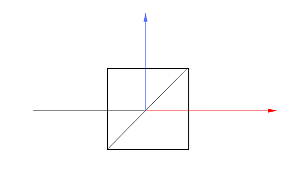

<center><i>Figure 3.3.1 - Beam Splitter Diagram</i></center>

In the above diagram, the beam of light is coming from the left and splits into two separate beams. The half-silvered mirror is placed diagonally in the box. We can place two beam splitters and two mirrors in a configuration called a **Mach-Zender Interferometer** and add detectors for each of the projected output beams.

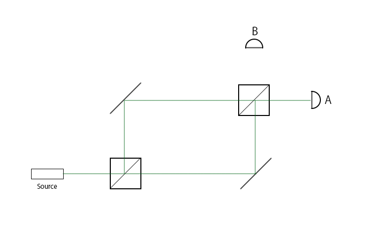

<center><i>Figure 3.3.2 - Mach-Zender Interferometer</i></center>

Using the configuration of beam splitters and mirrors described above, say we produce 100 photons. How many of those photons will be detected by B?

The answer is zero. All of the photons will be detected by A, the detector at B will never see a photon. This result seems unintuitive, if a beam splitter splits a stream of photons, why doesn't the second half-silvered mirror split both streams again? This is because $H^2=I$. In this experiment, the photon acted as a qubit, initialized to the state $|0\rangle$. After passing through the first beam splitter, the qubit entered superposition, but came back out of superposition after the second beam splitter. The Hadamard gate's matrix representation is:
$$
H=\begin{bmatrix}
\frac{1}{\sqrt2} & \frac{1}{\sqrt2} \\
\frac{1}{\sqrt2} & -\frac{1}{\sqrt2}
\end{bmatrix}
\\ \ \\ \ \\
HH|0\rangle=|0\rangle
$$
The $H$ gate can be decomposed into $H=\sqrt{Y}Z=X\sqrt{Y}$. Specifically, the Hadamard gate is a rotation of $\Delta=1$ around the Hadamard axis, $H=(X+Z)/\sqrt2$. The $H$ axis is a line in the $XZ$ plane where $X=Z$. Just like the $W$ axis, there is a matrix which generalizes a rotation of any amount:
$$
H^\Delta=
\begin{bmatrix}
\cos(\frac{\Delta\pi}{2})-\frac{i}{\sqrt2}\sin(\frac{\Delta\pi}{2}) & -\frac{i}{\sqrt2}\sin(\frac{\Delta\pi}{2}) \\
-\frac{i}{\sqrt2}\sin(\frac{\Delta\pi}{2}) & \cos(\frac{\Delta\pi}{2})+\frac{i}{\sqrt2}\sin(\frac{\Delta\pi}{2})
\end{bmatrix}
$$
These beam splitters are more than neat party tricks. Using the **KLM Protocol**, it is possible to create universal quantum computers using just mirrors, half-silvered mirrors, and phase shifters. 

#### Arbitrary Axes

The next step is to rotate our quantum state around any arbitrary axis. This is an applet which shows the accessible state space of rotating the state around any axis. The sliders on the left change the $\theta$ and $\phi$ of the quantum state and the sliders on the right change the $\theta$ and $\phi$ of the axis. The axis is set to the Hadamard axis by default.

<iframe height='500' scrolling='no' title='Arbitrary Axis Rotation Applet' src='..\resources\applets\arbitrary_axis\index.html' frameborder='no' allowtransparency='true' allowfullscreen='true' style='width: 100%; user-select:none;'>Arbitrary Axis Rotation Applet</iframe>

<center><i><a href="../resources/applets/arbitrary_axis/index.html" target="_blank">Applet 3.3.3</a> Arbitrary Axis Rotations Applet</i></center>

The matrix for rotating around any axis $\hat n$ can be written as the sum of the identity matrix and the Pauli matrices:
$$
\hat n^\Delta = \cos(\frac{\Delta\pi}{2})I-i \sin(\frac{\Delta\pi}{2})(n_xX+n_yY+n_zZ)
$$
This is the equation used to derive the rotation around the $W$ and $H$ axes described above. Alternatively, the same matrix can be written as the product of the $Y$ and $Z$ rotation matrices:
$$
a = \frac{n_\phi}{\pi} \\
b = \frac{n_\theta}{\pi} \\
\hat n^\Delta=Z^{\large a} Y^{\large b} Z^\Delta Y^{\large -b} Z^{\large -a}
$$
Note how the sum equation uses the axis' Euclidean coordinates and the product equation uses the axis' spherical coordinates.

Since a quantum state is mathematically equivalent to a vector, that implies we could use a quantum state as an axis to rotate around. For example, rotating around itself is always an identity operation:
$$
\psi^\Delta|\psi\rangle=I
$$
However, we don't actually know the $\theta$ and $\phi$ of some generic quantum state. To rotate around an axis, the coordinates of the axis must be known, otherwise how would we know which gates to apply?

### [3.4](#QCSG)   Quantum Registers

Up to this point, we have used the term _quantum system_ interchangeably with the term _qubit_ because we have only focused on a single qubit. However, a quantum system is a more general concept, it refers to all quantum objects of interest to us in a particular setting. When we have collection of qubits, it is called a _quantum register_ and they are grouped together under one quantum system. 
$$
|\psi\rangle=\frac{1}{2}(|00\rangle+|01\rangle+|10\rangle+|11\rang)
$$
Above is an example of a two qubit quantum system in equal superposition. The $|\psi\rangle$ is still used to describe the entire quantum register, although now there are more _basis states_. Rather than just having $|0\rangle$ and $|1\rangle$, there are now four basis states to describe every possible combination of states the qubits could collapse into. Each basis state also has a complex coefficient assigned to it, the probability of the quantum system collapsing into a particular basis state $i$ can be found: $P(|\psi\rangle=|i\rangle)=|c_i|^2$. In general, a quantum register of $n$ qubits can be described in ket notation:
$$
|\psi\rangle=\sum_{i=0}^{2^n} c_i|i\rangle \\
\text{where } \sum_{i=0}^{2^n}|c_i|^2=1
$$
Suppose we are given two separate qubits, how do we create our quantum system to describe both of them?
$$
\begin{equation}\begin{aligned}
|\psi_0\rangle&=\alpha_0|0\rangle+\beta_0|1\rangle \\
|\psi_1\rangle&=\alpha_1|0\rangle+\beta_1|1\rangle \\
\end{aligned} \\ \ \\
\begin{aligned}
|\psi\rangle=|\psi_1\rangle|\psi_0\rangle&= (\alpha_1|0\rangle+\beta_1|1\rangle)\otimes (\alpha_0|0\rangle+\beta_0|1\rangle) \\

&= \alpha_1\alpha_0|0\rangle|0\rangle+\alpha_1\beta_0|0\rangle|1\rangle+\beta_1\alpha_0|1\rangle|0\rangle+\beta_1\beta_0|1\rangle|1\rangle
\\
&= \alpha_1\alpha_0|00\rangle+\alpha_1\beta_0|01\rangle+\beta_1\alpha_0|10\rangle+\beta_1\beta_0|11\rangle

\end{aligned}\end{equation}
$$
The key to merging two separate qubits into one quantum system is the _tensor product_. This operation is denoted by the $\otimes$ symbol and it looks similar to distributing two binomials. There are different notations for the tensor product, but they all mean the same thing:
$$
|\psi_1\rangle\otimes|\psi_0\rangle=|\psi_1\rangle|\psi_0\rangle=|\psi_1\psi_0\rangle
$$
We have described how the tensor product works using the Dirac notation, but quantum states can also be described using vectors:
$$
|\psi_1\rangle\otimes|\psi_0\rangle=
\begin{bmatrix}
\alpha_1 \\ \beta_1
\end{bmatrix} \otimes
\begin{bmatrix}
\alpha_0 \\ \beta_0
\end{bmatrix} =
\begin{bmatrix}
\alpha_1
\begin{bmatrix}
\alpha_0 \\ \beta_0
\end{bmatrix} \\ 
\beta_1
\begin{bmatrix}
\alpha_0 \\ \beta_0
\end{bmatrix}
\end{bmatrix} = 
\begin{bmatrix}
\alpha_1\alpha_0 \\
\alpha_1\beta_0\\
\beta_1\alpha_0\\
\beta_1\beta_0
\end{bmatrix}
$$
In general, a tensor product between a vector with $n$ rows and another vector with $m$ rows produces a vector with $nm$ rows. The tensor product is associative, but it is not communitive, so $|\psi_0\psi_1\rangle\neq|\psi_1\psi_0\rangle$. For this reason, we need to be clear about the ordering of the qubits. The standard convention is to have the rightmost qubit be the least significant bit. This means the state $|100\rangle$ will represent the number 4 instead of the number 1. Since the quantum state is being created from an array of qubits, the indexes follow zero-based numbering. The least significant qubit is described as the zeroth qubit in the register. 

Here is an algorithm which will create the amplitude at index $row$ after the tensor product of $n$ qubits:

```python
def create_amplitude(row_index, qubits):
	amplitude = 1
	for i in n:
    	if ((row_index & 1 << i) == 0):
        	amplitude *= qubits[i].alpha
		else:
        	amplitude *= qubits[i].beta
	return amplitude
```

Consider the index $01001$ in a 5 qubit register. The amplitude at this position is $\alpha_4\beta_3\alpha_2\alpha_1\beta_0$. Each $0$ in the index corresponds to the amplitude being multiplied by that qubit's $\alpha$ component and each $1$ means the amplitude is multiplied by that qubit's $\beta$ component.

The algorithm above iterates through each bit in the index and multiplies the amplitude by the corresponding component depending if the bit is $0$ or $1$. This algorithm uses _bitwise operators_ to determine the state of a bit inside the index. The following bitwise operators are frequently used:

* `&` - Bitwise AND
* `|` - Bitwise OR
* `^` - Bitwise XOR
* `<<` - Bitwise left shift 
* `>>` - Bitwise right shift

#### Quantum Circuits

When describing which gates are being applied to which qubits, using the Dirac notation can become cluttered. _Quantum circuits_ are a visual way to show the ordering of the gates. Below is an applet to show a simple quantum circuit with 2 qubits and an X, Y, and Z rotation gate on each. 

<iframe height='300' scrolling='no' title='Simple Quantum Circuit Applet' src='..\resources\applets\simple_circuit\index.html' frameborder='no' allowtransparency='true' allowfullscreen='true' style='width: 100%; user-select:none;'>Simple Quantum Circuit Applet</iframe>

<center><i><a href="../resources/applets/simple_circuit/index.html" target="_blank">Applet 3.4.1</a> Simple Quantum Circuit Applet</i></center>

Starting from the left, first there are the inputs to the quantum circuit. Typically, a quantum circuit is initialized with $|0\rangle$ for each qubit, but sometimes a generic state $|\psi\rangle$ is the input when comparing multiple circuits. The top qubit is the least significant qubit which corresponds to the rightmost qubit in the  Dirac notation.

Next are all of the gates in the circuit. Each wire runs horizontally and contains a sequence of gates which are applied to the qubit. Unlike the matrix form of gates, the gates in a circuit are read left-to-right. In our simple circuit, the X gate is applied first, followed by the Y gate and then the Z gate. For this example, each gate has a slider which controls the $\Delta$ parameter of that gate.

The square on the right side is a visual representation of the quantum state. Each sub-box represents a basis state, the size of the circle represents the magnitude and the orientation of the circle represents the phase. The global phase is automatically adjusted so the $|0\rangle$ state remains real. 

This example is just a simple quantum circuit for demonstration purposes. A more advanced quantum circuit builder is available through <a href="https://algassert.com/quirk" target="_blank">Quirk</a>. 

#### Matrix Tensor Product

A 2-qubit quantum system can be created by using the tensor product on two vectors. How do we apply a gate to this larger vector? Our $2\times2$ matrices cannot be directly applied to a vector with $4$ rows, there would be a dimension mismatch. The key is to use the tensor product on the gate as well!
$$
|\psi_1\rangle\otimes H|\psi_0\rangle=(I\otimes H)|\psi_1\psi_0\rangle
$$
 If we would like to apply a Hadamard gate on the right qubit and nothing on the left qubit, it is the tensor product between the $H$ and $I$ matrices. In general, a tensor product between two matrices takes the form:
$$
\begin{bmatrix}
a & b \\ c & d
\end{bmatrix} \otimes
\begin{bmatrix}
e & f \\ g & h
\end{bmatrix} = 
\begin{bmatrix}
a
\begin{bmatrix}
e & f \\ g & h
\end{bmatrix} & 
b
\begin{bmatrix}
e & f \\ g & h
\end{bmatrix} \\
c
\begin{bmatrix}
e & f \\ g & h
\end{bmatrix} & 
d
\begin{bmatrix}
e & f \\ g & h
\end{bmatrix}
\end{bmatrix} = 
\begin{bmatrix}
ae & af & be & bf \\
ag & ah & bg & bh \\
ce & cf & de & df \\
cg & ch & dg & dh
\end{bmatrix}
$$
The tensor product for matrices is still non-communitive. In order to apply a $2\times2$ gate to the $i$th qubit, there must be $n$ matrices tensored together:
$$
|\psi_{n-1}\cdots\psi_{i+1}\rangle\otimes U|\psi_i\rangle\otimes |\psi_{i-1}\cdots\psi_0\rangle = 
\bigg( \bigotimes_{j=i+1}^nI \bigg) \otimes U \otimes \bigg(\bigotimes_{j=0}^i I \bigg) |\psi\rangle
$$
When applying just one $2 \times 2$ gate to a quantum register, it gets tensored with $n-1$ identity matrices. This fact highlights an interesting characteristic of the tensor product. Say we would like to apply two $2\times 2$ gates on a 2 qubit system, $U_0$ and $U_1$. We could tensor the gates together like shown with the general form of the tensor product, but we could also tensor each gate with the identity matrix like shown with the $i$th qubit form and then multiply:
$$
U_1 \otimes U_0=(U_1\otimes I)(I \otimes U_0)=(I\otimes U_0)(U_1\otimes I)
$$
Tensoring each matrix with the identity matrix and them multiplying them together is equivalent to tensoring the matrices together directly. Furthermore, the matrix multiplication of $U_1\otimes I$ and $I\otimes U_0$ is communitive! This can be generalized to any number of gates acting on a quantum register, the matrix multiplication between all of these identity-tensored gates is communitive.

### [3.5](#QCSG)   Controlled Gates

The goal of this section is to address how qubits interact with each other. So far, we have treated qubits as separate entities which can be operated on independently. To create a powerful model of computation, qubit states need to be able to impact each other. In quantum computing, we use transformations called _controlled operations_ which are able to connect qubits.

#### Controlled Not Gate

The most fundamental controlled gate is called the _controlled not_ and it takes in 2 qubits: a control qubit and a target qubit. In English, the transformation a controlled not (CNOT) gate performs is described as: _if the control qubit is_ $|1\rangle$, _then flip the target qubit_. We can create a truth table which describes the operation if the left qubit is the control and the right qubit is the target
$$
\begin{equation}\begin{aligned}
|c\ t\rangle& \\
|00\rangle&\rightarrow|00\rangle \\
|01\rangle&\rightarrow|01\rangle \\
|10\rangle&\rightarrow|11\rangle \\
|11\rangle&\rightarrow|10\rangle
\end{aligned}\end{equation}
$$
The above ket notation shows a truth table for every basis state. If the control qubit is $|0\rangle$, the CNOT acts as an identity operation and nothing happens. If the control qubit is $|1\rangle$, the target qubit is flipped. The same operation can be visualized in the tensored vector form:

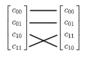

The CNOT transformation switches the placement of the $|10\rangle$ and $|11\rangle$ coefficients. The CNOT gate is also called the CX gate since it is essentially a controlled X rotation. The matrix form of the CNOT gate is written as:

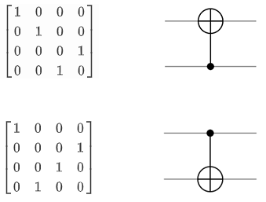

Notice how the transformation the CNOT applies changes depending which qubit is acting as the control. In circuit form, the small black dot denotes the control qubit and the large $\oplus$ shows the target qubit. Remember that we are using the standard where the topmost qubit line is the least significant qubit. The truth table and the tensored vector descriptions are referring to the top circuit where the control qubit is below the target qubit. Some sources use a different standard where the bottom-most qubit is the least significant qubit, which would switch the matrix-circuit representations.

The control and target qubits cannot be the same qubit in a CNOT gate. Such an operation would create the following truth table, which is not reversible:
$$
|0\rangle\rightarrow|0\rangle \\
|1\rangle\rightarrow|0\rangle \\
\text{Not a reversible operation!}
$$
One question students often ask is "why use the $\oplus$ symbol for the CNOT gate?" In computational logic, the $\oplus$ symbol refers to the exclusive or (XOR) of two bits. The controlled-not gate is a reversible version of XOR, the control qubit is unaffected and the target qubit becomes the XOR of the control and the target:
$$
|c\rangle|t\rangle\rightarrow|c\rangle|c\oplus t\rangle
$$

#### SWAP Gate

An interesting property of the XOR operation is that it can swap the values of two variables without using a temporary variable. Consider the binary variables $X$ and $Y$ and perform the following algorithm on them:
$$
X := X\oplus Y \\
Y := Y\oplus X \\
X := X\oplus Y
$$
After 3 XORs, the variable $X$ will contain the original value of $Y$ and vice versa. As we have already discussed, the CNOT gate is the reversible equivalent to the XOR gate, which means we can create a SWAP gate out of 3 CNOT gates:

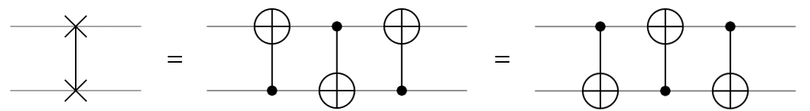

This gate switches the incoming qubit states so the bottom qubit now contains the original state of the top qubit and vice versa. The SWAP gate is symmetric with respect to the qubits it is swapping. That is to say, $\text{SWAP}(|\psi\rangle,|\varphi\rangle)=\text{SWAP}(|\varphi\rangle,|\psi\rangle)$. As expected, the SWAP gate is its own inverse, so two sequential SWAP gates is an identity operation. The matrix of the SWAP gate is:
$$
\text{SWAP}=
\begin{bmatrix}
1 & 0 & 0 & 0 \\
0 & 0 & 1 & 0 \\
0 & 1 & 0 & 0 \\
0 & 0 & 0 & 1
\end{bmatrix}
$$

#### Controlled Z Gate

Similar to how the CNOT gate is a controlled X rotation of $\Delta=1$, we can also create the CZ gate for a controlled Z rotation. The CZ gate performs the following operation:
$$
\begin{matrix}
|c\ t\rangle\quad\   \\
|00\rangle\rightarrow&\ \ \ |00\rangle \\
|01\rangle\rightarrow&\ \ \ |01\rangle \\
|10\rangle\rightarrow&\ \ \ |10\rangle \\
|11\rangle\rightarrow&-|11\rangle
\end{matrix}
$$
The controlled Z gate applies a phase shift only when both qubits are in the state $|11\rangle$. This operation is symmetric with respect to the input qubits:

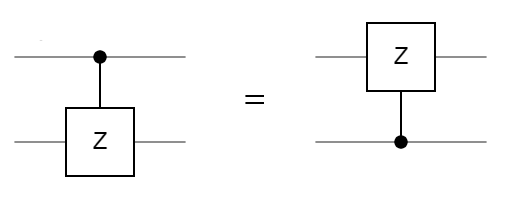

Since the orientation of the CZ gate doesn't matter, another common notation for the gate is to have control dots on both qubits. The matrix representation of the gate is:

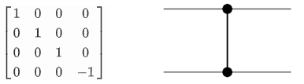

A CZ gate can be constructed using a CNOT gate and 2 Hadamard gates like so:

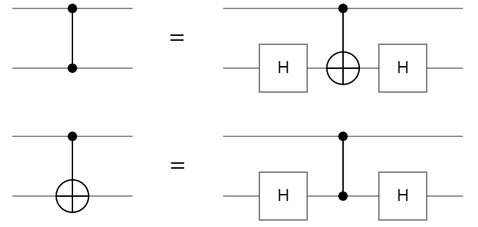

Using the above relationship, we can flip the CZ gate since it is symmetric and create a method to flip the CNOT gate using Hadamard gates.

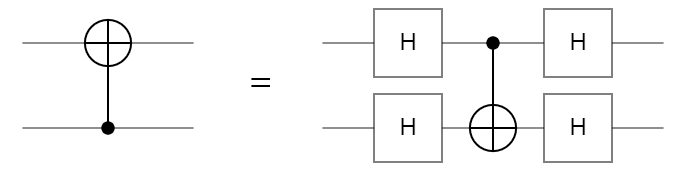

The controlled Z gate has applications in simulating quantum circuits on quantum computers. The runtime of simulating a CZ gate is faster than a CNOT gate, so if a circuit can be transformed into an equivalent circuit using approximately the same number of gates, the simulation will be noticeably faster.

#### Controlled U Gate

The controlled X and controlled Z gates are specific instances of the general controlled U gate. Any single qubit gate $U$ can be transformed into a CU gate:
$$
U=\begin{bmatrix}
u_{00} & u_{01} \\
u_{10} & u_{11}
\end{bmatrix}
$$
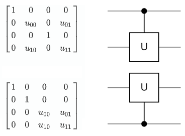

Every 2 qubit gate described above has acted on adjacent qubits inside the circuit. It is also possible to have the control further away and "jump over" qubits to reach the target. The CU gate does not impact the two qubits which do not have a control or gate placed on them. However, what if we have a constraint on our circuit that all 2 qubit gates must act on adjacent qubits? This can be overcome by simply using SWAP gates to pull the control closer:

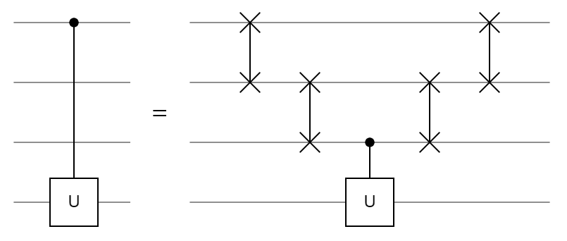

This idea can be extended for any number of intermediate qubits by increasing the staircase of SWAP gates. Engineering physical quantum computers is already a challenging task, creating controlled gates between any pair of arbitrary qubits in the circuit may be infeasible. As a result, this trick can be used so engineers only need to implement controlled operations between adjacent qubits in the circuit. 

#### Circuit Specifications

In the above CU circuit, originally there weren't any gates on the middle two qubits. However, there are several gates acting on them after the transformation. In this circuit, the middle two qubits are acting as _ancilla qubits_. An ancilla qubit is a qubit which has operations performed on it that do not directly contribute to the result, but help indirectly. They typically come in two flavors: identity ancilla qubits and garbage ancilla qubits. 

The ancilla qubits in the CU circuit are acting as identity ancilla qubits because even though there are gates being applied to them, the end result is equivalent to the identity operation. These identity ancilla qubits were borrowed to accomplish a more complicated goal, but had the affects undone after the goal was accomplished. Garbage ancilla qubits do not have such restrictions, the results after measuring a garbage ancilla qubit are discarded. Garbage ancilla qubits are particularly useful in quantum computation for reducing the _depth_ of a circuit. 

The depth of a circuit refers to how long it takes to run. This is measured by the number of _timesteps_ a circuit has. In one timestep, several gates can be applied to the quantum register, but two gates cannot be applied to the same qubit in a single timestep. Many quantum circuits are extremely parallelizable since multiple gates are applied in sync. The depth of a circuit can change after a quantum complier changes the circuit to fit the architecture of the computer. For example, if our quantum computer can only apply two qubit gates to adjacent qubits, the CU circuit above transforms from having a depth of 1 to a depth of 5. This is similar to how classical programs change length after being compiled for a target machine. Typically, the actual depth of a quantum circuit is not used, just the asymptotic gate depth. It is expressed using big-oh notation as a function of the input. For example, linear gate depth would be $O(n)$. 

### [3.6](#QCSG)   Quantum Programming

After discussing the operations a quantum computer can perform to its qubits, how would we program a quantum computer? To date, a high-level quantum programming language has not yet been developed so modern quantum computers are coded with individual gates, similar to assembly for classical computers. There aren't even any independent quantum languages, most of the "languages" are just libraries accessed from classical languages.

Modern quantum programming workflow first creates a desired circuit in a quantum programming library on a classical computer. Then that circuit is sent to either a quantum computer or a quantum simulator to run. After, the result of the computation is returned to the user, typically as a histogram of measurement results. This histogram is now considered classical data and the user can use it as they please. 

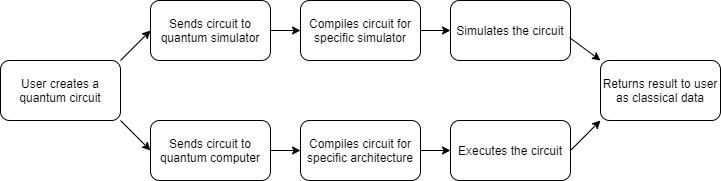

<center><i>Figure 3.6.1 - Modern Quantum Programming Workflow</i></center>

The compilers are a very important step in this process which often get overlooked. Just like classical compilers, a quantum compiler takes in some general circuit and changes the gates to run most effectively on the target platform. The platform can be a specific architecture or simulator type which handles certain types of circuits better than others.

There are many libraries used for creating quantum circuits, most companies have developed their own so it is likely there won't be a standard one until quantum computers become more ubiquitous. 

#### Qiskit

Released in March of 2017, Qiskit is IBM's quantum computing framework for Python. Users can create circuits and use a range of tools examine them. Qiskit comes with four components: Terra, Aer, Aqua, and Ignis. Terra is element used to build circuits and send them to a real quantum computer over the cloud. Aer is a quantum simulator which can model a perfect or imperfect quantum computer. Aqua is a package of premade algorithms usable without understanding of quantum computing. Ignis is a collection of tools for understanding noise. Qiskit is the most used framework among the quantum computing community and is the one used in this document for describing circuits with code.

#### Q#

Released in December of 2017, Qsharp is Microsoft's quantum computing framework for C#. Currently, Q# is just a quantum simulator capable of processing up to 32 qubits on a local machine and up to 40 on Microsoft Azure, their cloud computing service. The community surrounding Q# expects Microsoft to eventually offer a hardware service similar to Qiskit using _topological qubits_. Topological qubits are a currently theoretical implementation of a qubit which is still under development.

#### Cirq

Released in July of 2018, Cirq is Google's quantum computing framework for Python. Similar to Q#, Cirq is just a quantum simulator with no currently announced plans of offering a physical backend to run circuits. Cirq has close ties with Google's OpenFermion project which uses quantum algorithms to simulate fermionic systems like quantum chemistry. 

### [3.7](#QCSG)   Case Study: Google's Quantum Supremacy

In late 2019, Google announced they had achieved _quantum supremacy_ on their 53 qubit quantum processor named Sycamore, published in <a href="https://www.nature.com/articles/s41586-019-1666-5" target="_blank">Nature</a>. Quantum supremacy is the term for when a quantum program can beat a classical program at a task. What kind of task? It doesn't matter. There is no official benchmark, so the task can be any type of algorithm or can simply have a useless objective. As long as the QPU is significantly faster than a classical computer at **any** objective, quantum supremacy is declared.

What task did Google use to have their quantum computer compete in? Simulating a quantum computer. Sycamore is a quantum computer, so the simulation is just running a quantum circuit. So as long as the quantum computer can run faster than a classical computer can simulate it, the quantum computer wins. This may appear rather silly since there isn't really any objective to the computation, but that is actually why it is clever. If there was an objective to compute then there would be alternative methods for a classical programmer or patterns to exploit to make the classical program faster. 

Specifically, Google called this task _random circuit sampling_. Every quantum circuit creates a probability distribution, so the objective was to find the probability distribution of a randomly generated circuit. A random circuit does not have any patterns for a classical programmer to use for time or memory exploitations. However, not all quantum circuits take the same amount of time to simulate. The hardest circuits for a classical simulator are random and all the qubits are highly entangled (but not maximally entangled)! 

There are limitations on the quantum computer as well. The Sycamore processor is noisy, every gate applied causes small errors to build up and can lead to the wrong answers if too many gates are applied. So the ideal circuit should have the following properties:

- No observable patterns
- Highly entangled
- Small depth

To create circuits that have all three properties, the Google quantum team used a pseudorandom generator which uses a seed to create circuits in this format:

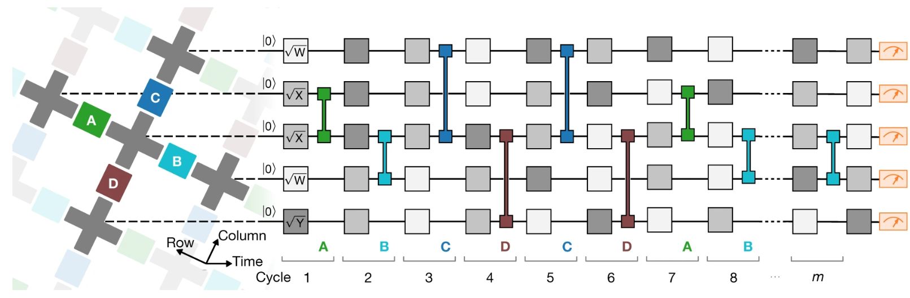


<center><i>Figure 4.5.1 - Pseudorandom Circuit Architecture</i></center>

The circuit is divided into _m_ cycles in which every cycle has 1 single qubit gate applied per qubit followed a double qubit gate. The single qubit gates are chosen pseudo randomly and can be $\sqrt{X}$, $\sqrt{Y}$, or $\sqrt{W}$. Two gates of the same axis cannot be chosen sequentially. The $\sqrt{W}$ gate is a rotation of $\frac{\pi}{2}$ radians around the axis $(X+Y)/\sqrt2$. Similar to the Hadamard axis, this axis is formed by the line $X=Y$ when $Z=0$. The double qubit gates are chosen from a set sequence: repeat $ABCDCDAB$. The chosen letter represents the gate being applied to every pair of neighbor qubits connected by a colored coupler. 

<iframe height='500' scrolling='no' title='Sycamore Coupler Applet' src='..\resources\applets\sycamore_couplers\index.html' frameborder='no' allowtransparency='true' allowfullscreen='true' style='width: 100%; user-select:none;'>Sycanmore Couplet Applet</iframe>

<center><i><a href="../resources/applets/sycamore_couplers/index.html" target="_blank">Applet 4.5.2</a> Sycamore's QPU Architecture</i></center>

To understand the double qubit gates better, we can look at Sycamore's qubit layout. In figure 4.5.2, the gray crosses represent qubits and the colored boxes are couplers which connect the qubits together. The outlined cross on the top row is a qubit which does not work which is why this QPU is only 53 qubits instead of the original 54. When a double qubit gate is chosen from the set, for example $A$, all of the green couplers activate at the same time. So the double qubit layer in the circuit does not just refer to one pair of qubits; it refers to all pairs of qubits joined by a green coupler. Not every qubit is affected by the $A$ gate however, since the bottom row does not have any green couplers connecting to them.

#### Quantum vs. Classical

Every quantum circuit essentially creates a probability distribution, but the way a quantum computer finds this distribution is different than a classical computer. A quantum computer approximates the distribution by running the circuit many times and recording the result of each measurement. After taking a large number of samples, the sampled distribution is roughly equal to the real distribution. Google's team sampled their largest circuit 30 million times, taking around 100 minutes.

Google's team used a Schrödinger/Feynman hybrid algorithm to simulate a 43 qubit circuit on a classical computer. The Schrödinger algorithm stores all $2^n$ coefficients in memory and the Feynman algorithm calculates each coefficient independently which only requires a polynomial amount of memory, but requires exponentially more time proportional to the depth of the circuit. 

In their paper, the team made the claim that using this hybrid algorithm to simulate the largest 53 qubit circuit would take 10,000 years on the world's best supercomputers, thus proving quantum supremacy. This time estimate was created by assuming the memory was constrained to Random Access Memory (RAM). Other experts did not agree with this assumption.

#### IBM's Rebuttal

The quantum computing team at IBM <a href="https://www.ibm.com/blogs/research/2019/10/on-quantum-supremacy/" target="_blank">responded</a> to Google's claim to quantum supremacy by using a pure Schrödinger algorithm. They showed that it was possible to rotate the memory for the quantum state out to disk, only keeping the active parts in RAM. Every coefficient is 8 bytes since they are complex numbers, stored as two single precision floating point numbers. The quantum state is $8\times2^{53}$ = 64 petabytes. That size is certainly large, but not unachievable by modern computers. IBM's team used a host of performance enhancing techniques to perform the simulation in 2.5 days. 

By definition, Google's team still technically proved quantum supremacy since the quantum computer ran faster than the classical simulation (100 minutes < 2.5 days), even if it wasn't by their predicted margin of 10,000 years. However, due to the exponential nature of simulating quantum computers, a 100 qubit quantum state would take $8\times2^{100}\approx$ 9,000,000,000,000,000 (9 quadrillion) petabytes to store. This amount of memory is simply unachievable by modern or near future computers. Even if a 53 qubit processor strikes controversy over if it deserves quantum supremacy or not, 100 qubit processors will be developed in the near future and the outcome will be clear.

One incredibly important point brought up in IBM's response is the entire concept of quantum "supremacy". The nature of quantum  processors are to be devices which coordinate with classical computers, not compete against them. The notion of claiming quantum supremacy is no less ridiculous than claiming "GPU supremacy" because a GPU was shown to be faster at one specific task. The term quantum supremacy was blown out of proportion by the media and broadly misunderstood by the general public. 

------

​         [$\leftarrow$Chapter 2](../chapter2)                                                                                                                                                                                                              [References$\to$](../references)