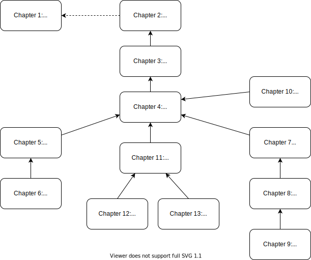

# [QCSG](..)

<h3>The Quantum Computing Survival Guide</h3>

##### Written by River Way

## Preface

This document is meant to be a modern equivalent to a textbook for quantum computing. Modern equivalent - don't textbooks still exist in today's world? Yes, but it is our belief that the current format of paper textbooks do not translate well to the new generation's style of learning. 

* This document has links to other parts of itself for ease of access as well as links to outside resources. This format is better suited for reading on a computer than using a glossary or series of appendices. 
* This document uses applets to produce animations and interactive figures. The PDF version does not support these applets, so static images are used as a replacement. Use the web version to interact with the figures.
* Every question has an answer. With the advent of online answer services, creating a list of exercises for the reader is synonymous with providing homework questions for teachers to use. This does nothing but discriminate against those who cannot afford the paid answer services. Instructors who decide to use this textbook in the setting of a classroom will need to create their own homework, or at least modify the existing questions we provide. 
* This document is free. It will always be free. All future versions of this document will be free. Nearly all textbooks are pirated, scanned, and uploaded to the internet. Why not provide an encouraging environment for students rather than making them feel like criminals for learning?
* We accept corrections, suggestions, and new ideas from _anyone_. Simply post a new issue on the public [GitHub repository](https://github.com/zackatoo/QuantumComputingSG) for this textbook using the proper format. Having a public GitHub also allows any reader to view all past versions of the document and the authors of those changes.
* This document is covered by the [CC BY 4.0](https://creativecommons.org/licenses/by/4.0/) license, meaning the material may be redistributed, copied, or modified freely, by anyone, so long as proper attribution is given. The code associated with this document is covered by the [Apache License 2.0](https://www.apache.org/licenses/LICENSE-2.0), meaning the code may be redistributed, used in private or public projects, or modified freely, by anyone, so long as proper attribution is given. The code can not be patented except by the original author.
* We expect this document to eventually be adapted into a video lecture series, free and available to everyone, of course. 

#### Quantum? What's that?

_Quantum mechanics_ are the laws which govern _quantum physics_, the study of very small particles such as atoms, electrons, and photons. No previous knowledge of quantum mechanics or quantum physics is assumed or required to understand this document. However, we do make some assumptions about the reader's knowledge of mathematics and computer science:

* Precalculus: Complex Numbers, Trigonometry, Polar Coordinates, Radians
* Linear Algebra: Vectors, Matrices, Matrix Multiplication, 3 Dimensional Math
* Discrete Mathematics: Boolean Algebra, Sets, Turing Machines, Complexity Classes
* Computer Science: Introductory Programming, Data Structures, Algorithms, Computer Organization
  * These topics are especially important: Arrays, Big-Oh Notation, Bitwise Manipulation

Some amount of review for these topics is provided, but we are assuming readers will already have been introduced. We expect this document will be understandable to a Computer Science undergraduate by the end of their second year. 

#### Outline of the Document

The first chapter is a simple introduction to the history of quantum computing and why it is & will be useful. This chapter is not required, but can be useful for providing a bridge to the real world. The next three chapters form the foundations of quantum computing. After the chapter on entanglement, the document opens up, allowing instructors to focus on a particular subfield if they so choose.

<i>Figure 0.1.1 The Chapter Dependency Graph</i>

#### Citations

**MLA8**

Way, River. *Quantum Computing Survival Guide*. Github, 2020.

##### CSE Manual Scientific Style and Format

Way, River. 2020. Quantum Computing Survival Guide. New York (NY): Github.

------

​                                                                                                                                                                                                                                    [Chapter 1$\to$](../chapter1)